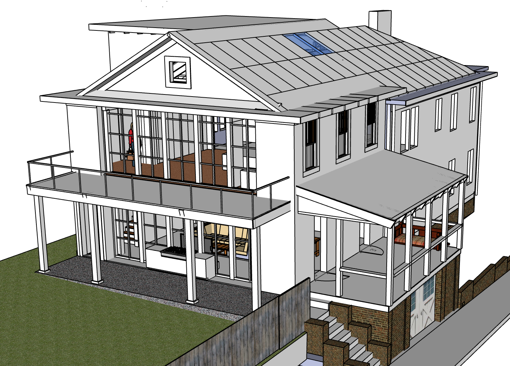
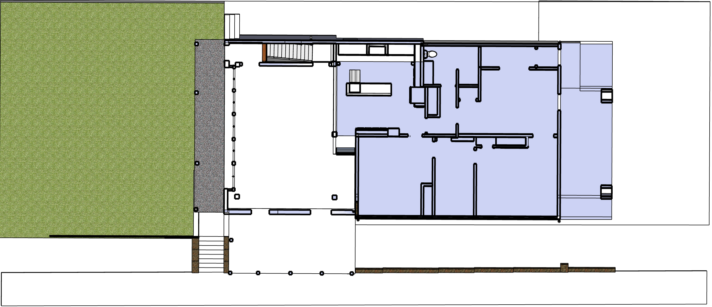

# Residential Mass Timber

<!--

Home details
https://clustrmaps.com/a/1qv6on/
-->

<a href="https://model.earth/community/projects/wood/">Mass Timber Panels (Dowel or Nail Laminated)</a> akin to the [Kendeda Living Building](https://livingbuilding.gatech.edu/) - [News](https://livingbuilding.gatech.edu/news/wsj-georgia-techs-kendeda-building-pits-latest-sustainable-tech-against-atlantas-swampy-climate)  

---
Robust insulation - EF Blocks made of recycled styrofoam  
Triple-pane glass windows and automated external blinds  
Passive envelope - Separate from existing house, a 1906 duplex  
Energy-efficient radiant cooling and heating in the flooring  
Fans circulating air between 4 levels, dehumidifying system  

On top of glulam columns and beams, decking made of nail laminated timber (NLT) panels<!-- constructed in partnership with Georgia Works-->. Locally salvaged wood and FSC-certified southern yellow pine. 2”x 6” boards nailed to 2”x 4” spacers, creating floor panels that measure roughly 10’x10’ each.<!-- https://gfagrow.org/timber-in-georgias-first-living-building/ -->  

<a href="sketchup/721-Grant-Street.skp">SketchUp Model (22 MB)</a>  
[Basement](basement)<!--[Livingroom](livingroom/img/)-->  
[Kitchen](kitchen)  

   
<!--
   
-->
   

<!-- TGI Wood Engineered Joists - better quality than dimensional lumber

Plywood ($22) deals with water better than OSB $20  
Windows have a tendency to leak over the years

Metalbenderz.com - 16" floors too thick
678-391-4423

-->

   

## Dimensions

### Existing:
2,438 ft² with laundry areas, which will be removed. (Dimension source: Funton county website)    
2,355.4 ft² two floors retained (with laundry area removed)  
1,177.7 ft² per floor retained (includes stairwell)  

### New Addition:
639.85 ft² per floor (includes stairway openings and all walls)   
62 ft² per floor - North jut-out adjenct to existing kitchen.  
1,403.7 ft² total new addition

Two Floors (excluding attic and basement): 2,355.4 + 1,403.7 = 3,759.1 ft²  
Survey says: Allowable house 3,750 ft², however we may be able to exceed since the home is a duplex.  
<!-- Total: 5,079.9 ft² -->

### Existing Main Floor Thickness   
(Existing, above crawl space)  
Flooring: 3/4"  
Wood under flooring: 15/16"  
Beam: 7 3/8"  
Total: 9 1/16”  

### Existing Second Floor Thickness  
9 7/8” (includes ceiling plaster and wood flooring) - Measured at water heater pipe  

### Existing Attic Floor Thickness
Beam: 5 3/8"  
Wood and plaster: 1" (about)  
Total: 6 3/8"  

### Existing Roof
The roof pitch is 7' in 12' for 30.26°

90" from top of attic floor joist to bottom of a rafter at the roof ridge  
(The bottom of the center ridge is over half an inch higher than bottom of rafters.)  

Rafters are 5 13/16" wide.  
(Rafters are 6 3/16" on vertical cut, so the distance from top of joist to the underside of roof is 96 3/16")   
