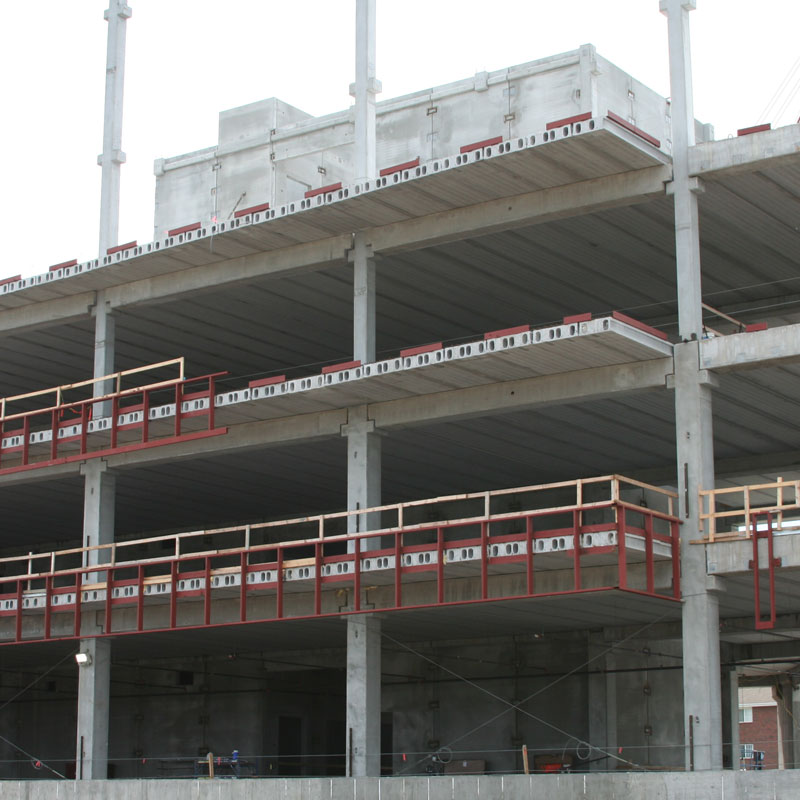

# Basement

  

  

### Zero Emission Concrete

Atlanta-based Thomas Concrete has been using the Canadian CarbonCure system since 2016.
[CNN Article](https://money.cnn.com/2018/06/12/technology/concrete-carboncure/index.html)  

"CarbonCure involves injecting carbon dioxide captured from various other industrial processes into concrete during the mixing process. A chemical reaction would “mineralize” that carbon dioxide, which would have the added benefit of making the concrete compressively stronger." “We have seen no downsides to using CarbonCure,”  Drew Millwood, the Thomas Concrete technician who oversaw the Kendeda job, wrote to me in an email. “It allows for cement reduction in any mix it is used in and provides strength at or above design. No cost increase is involved in a mix containing CO2 as the savings from cement reduction offset the cost of CO2 delivery. Equipment costs are easily recouped due to the savings.” - [source](https://livingbuilding.kendedafund.org/2019/07/16/carboncure/)  

### Radiant pumping, chiller and air-handling unit.

Considering as a means to avoid duct work. Kendeda Living Building 

### Hollow Core

Energy-efficient cooling. Heat-sink in the main floor coreslab  

8” slab + 2” concrete topping. 10” total.  

4’ wide hollow core slabs.  2 @ 24’ 5 ½”, 4 @ 20’ 11 ½”, 3 @ , 3 @ 10’ 11”, o1 @ 4’ 3 ¾”, 1 @ 3’ 10 ½”  

## Insulating Concrete Form (ICF) Considerations

### EF Block - A composite ICF  
[EF Block](http://www.efbm.com/EF-Block.html) is made from a mix of expanded polystyrene (EPS) and Portland cement.  
[YouTube](https://www.youtube.com/watch?v=LuSkt1rm3Zs) from Andrew Lane, 706-296-6631  
<!--
Andrew Lane, Master of Sustainable Solutions: Arizona State University Dec 2016
Major US Army(Retired)
Mobile: 706-296-6631
Mail: aslane1 asu.edu
https://www.linkedin.com/in/andrew-lane-31930762/
-->

[Ledger Board](https://www.youtube.com/watch?v=rNclzrZ-PUs&app=desktop)  

Coatings: Portland stuccos and acrylic polymers (textured acrylic finishes) applied directly to blocks.  
PermaCrete <!-- PermaCrete.Com --> by EF Block 

### Basement ICF Forms

[Logix icf](https://logixicf.com/blog/insight-and-advice/designing-walls-built-with-insulated-concrete-forms-save-time-and-money/)  

[Polysteel Insulating Concrete Forms](http://www.polysteel.com/construction.htm) - Roof angle  
Similar: Fox Blocks  

#### [Concrete Industries - Indiana](https://concreteindustries.com/hollowcore/)
**Specs**  
[8" Hollowcore with 2" composite topping](https://concreteindustries.com/wp-content/uploads/2017/07/Hollowcore-Load-Table-2in-Composite.pdf)  
[8" Hollowcore with no composite topping](https://concreteindustries.com/wp-content/uploads/2017/07/Hollowcore-Load-Table-No-Composite.pdf)

<!--
  

Student researcher explaining an innovative [seismic retrofit](https://www.constructionspecifier.com/new-research-council-formed-for-concrete-industry/). 
Send suggestions to [ACI Foundation](https://www.acifoundation.org/research/suggestresearch.aspx)  

### Cement Ceilings

[Cement Ceiling - Drywall Soundproofing](https://www.youtube.com/watch?v=OEs3jlNOzwY)
-->

### Precast Concrete

[Precast Concrete Suppliers serving Georgia](https://www.thomasnet.com/georgia/precast-concrete-17311002-1.html)  

### Concrete with Cellulose Nanocrystals

Cellulose nanocrystals provide an avenue for water to hydrate cement particles when mixing.  

**cellulose-infused concrete**  
cellulose-infused concrete is stronger  
cellulose-infused concrete sets faster  

[Purdue Researchers](https://www.purdue.edu/newsroom/releases/2018/Q1/purdue-researchers-show-concrete-infused-with-wood-nanocrystals-is-stronger,-plan-to-use-it-in-california-bridge.html)  
[Thomas parking lot in Greenville](http://www.thomasconcrete.com/latest-news/thomas-concrete-partners-in-the-debut-of-a-concrete-mix-infused-with-cellulosic-nanomaterial)  

### Foam Floors

[Quadlock](https://www.quadlock.com/ICF-Floors-and-Roofs/quad-deck.htm)  
[Pop-up house - Long rectangular foam blocks for floor and ceiling - In France](https://www.mbandf.com/en/parallel-world/pop-up-book-pop-up-food-truck-pop-up-house)

<!--
ICF insulated concrete foundation
ICF Builder
triple pane windows with argon fill on the north side of the house
-->
