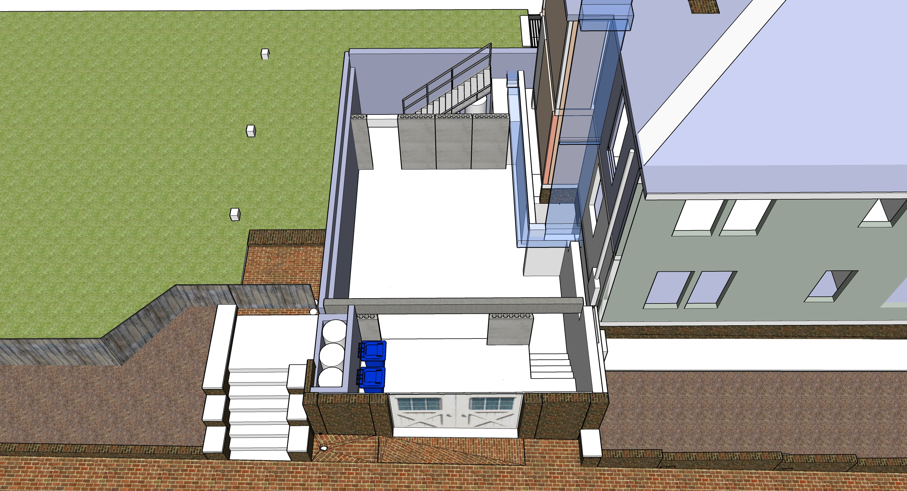
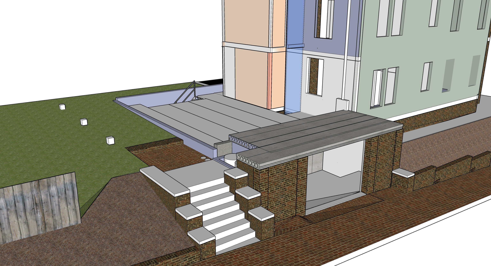

# Construction Phases

<a href="sketchup/721-Grant-Street.skp">Download SketchUp File (22 MB)</a>

Phase 1
1. Column bases for she-shed (small)
1. Remove rear and position as she-shed (Maybe use a crane)
1. Remove tree which is too close to other tree (small, or use crane)
1. Jackhammer and install cement pad for AC Units
1. Move AC Units, extend freon lines
1. Basement, north bumpout foundation, rear porch pedistals
1. Coreslab
1. Basement window under porch
1. Sump pump and drain pipes
1. Brick porch brickwork, reset sidewalk, cement steps
1. Basement sliding doors
1. Wooden porch steps - detachable, over rain barrels
1. Install tiny door, sunburst (Abbey)

Phase 2
1. Framework including porches
1. Roofing for entire house (prep for solar)
1. Windows and siding on addition
1. 3 stairways (maybe steel stairway in basement)
1. Put new freezer unit upstairs (will move downstairs later)

Phase 3
1. Remove old black storm windows
1. Minor repairs, paint prep, filling holes
1. Paint entire exterior
1. Add white storm windows

Phase 4
1. Grey water system
1. Solar panels
1. AC and ducts for attic unit
1. South upstairs bathrooms and laundry area
1. AC Unit in south porch roof
1. Heating unit in basement integrated with Coreslab
1. New upstairs counter and sink in craft room (temporary kitchen area)

Phase 5
1. Downstairs Kichen - cabinets, sink, oven, freezer unit
1. Kitchen and craft room vents
1. Grate over HVAC units
1. Rear barbecue grill stone enclosure
1. Tiles laid out for rain absorption as back porch (small)
1. Rain barrels and pipe hookup under south steps

Phase 6
1. Move existing front stairway (small)
1. Upstairs tub, move sink, new toilet
1. Add downstairs shower under stairway

Phase 7 (optional)
1. Light well using elevator shaft
1. Basement chiller and elevator shaft duct
1. Elevator

Several projects indicated as small may be done by Loren, dependent on cost.
  

---

# Basement

  
 

### Zero Emission Concrete

Atlanta-based Thomas Concrete has been using the Canadian CarbonCure system since 2016.
[CNN Article](https://money.cnn.com/2018/06/12/technology/concrete-carboncure/index.html)  

"CarbonCure involves injecting carbon dioxide captured from various other industrial processes into concrete during the mixing process. A chemical reaction would “mineralize” that carbon dioxide, which would have the added benefit of making the concrete compressively stronger." “We have seen no downsides to using CarbonCure,”  Drew Millwood, the Thomas Concrete technician who oversaw the Kendeda job, writes: “It allows for cement reduction in any mix it is used in and provides strength at or above design. No cost increase is involved in a mix containing CO2 as the savings from cement reduction offset the cost of CO2 delivery. Equipment costs are easily recouped due to the savings.” - [source](https://livingbuilding.kendedafund.org/2019/07/16/carboncure/)  

## Coreslab

  
 

### Hollow Core

Heat-sink in the main floor coreslab stores solar energy to radiat out at night.  

8” slab + 2” concrete topping. 10” total.  
<!--
4’ wide hollow core slabs.  2 @ 24’ 5 ½”, 4 @ 20’ 11 ½”, 3 @ , 3 @ 10’ 11”, o1 @ 4’ 3 ¾”, 1 @ 3’ 10 ½”  
-->

[Concrete Industries - Indiana](https://concreteindustries.com/hollowcore/)
**Specs**  
[8" Hollowcore with 2" composite topping](https://concreteindustries.com/wp-content/uploads/2017/07/Hollowcore-Load-Table-2in-Composite.pdf)  
[8" Hollowcore with no composite topping](https://concreteindustries.com/wp-content/uploads/2017/07/Hollowcore-Load-Table-No-Composite.pdf)

 

PCM placed in concrete core slab tubes as a thermal storage and supply system <a href="https://www.sciencedirect.com/science/article/abs/pii/S0378778815300591">PCM Research</a> 
  

<!--
Student researcher explaining an innovative [seismic retrofit](https://www.constructionspecifier.com/new-research-council-formed-for-concrete-industry/). 
Send suggestions to [ACI Foundation](https://www.acifoundation.org/research/suggestresearch.aspx)  

-->

### Precast Concrete

[Precast Concrete Suppliers serving Georgia](https://www.thomasnet.com/georgia/precast-concrete-17311002-1.html)  

### Concrete with Cellulose Nanocrystals

Cellulose nanocrystals provide an avenue for water to hydrate cement particles when mixing.  

Cellulose-infused concrete is stronger and sets faster  

[Purdue Researchers](https://www.purdue.edu/newsroom/releases/2018/Q1/purdue-researchers-show-concrete-infused-with-wood-nanocrystals-is-stronger,-plan-to-use-it-in-california-bridge.html)  
[Thomas parking lot in Greenville](http://www.thomasconcrete.com/latest-news/thomas-concrete-partners-in-the-debut-of-a-concrete-mix-infused-with-cellulosic-nanomaterial)  

<!--
ICF insulated concrete foundation
ICF Builder
triple pane windows with argon fill on the north side of the house
-->

### Radiant pumping, chiller and air-handling unit.
<!--A means to avoid duct work applied at the Kendeda Living Building.  -->

Our central elevator shaft will allow chilled air to fall from an attic AC unit.  
A small AC unit will also reside within south porch ceiling.  
Two existing HVAC units will reside under grate on north side of house.  
Chiller in basement will pump cold air up a duct within elevator shaft.  

## North AC Unit, Grey Water Storage and Covered HVAC Units

  
 

---

[Home](../)

