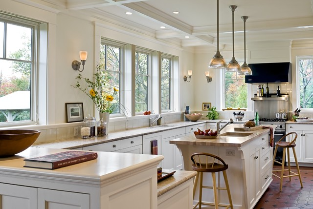
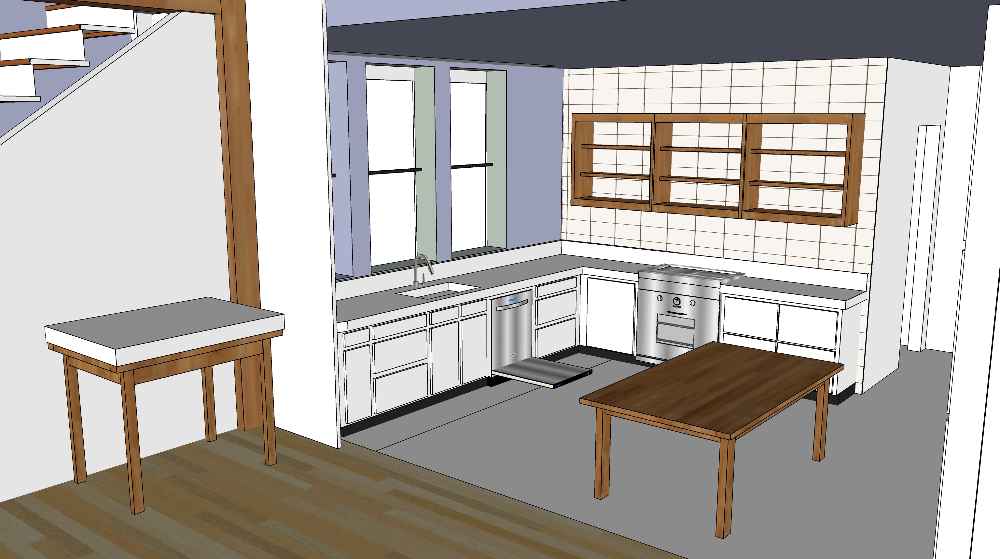

# Kitchen

  
 

Spot lights on walls (adjustable eyeball)    

2 or 3 medium pendant lights over island  

“Bridge style” sink faucet - pipe connects faucets  
No divider in sink.

Concealed trash and recycling bin pull out.  

Ikea comparable to more expensive custom cabinet makers.
Make sure Ikea surface quality is consistent. 
Ceasarstone - most durable
<!--
Jill Blass has Shaker-style panels.
Mark Mroz (fancywoodworks.com) builds shelves and custom cabinets, and the cost is only a little more than Ikea.
He assembles it all from wood and uses his spray shop.
-->

  

  

<!--
Old Kitchen window dimensions (to be removed):
94” rod (86” trim to trim with 4” on each side) - Used 83” to 152”

LENDA curtains - shorter 98” height (55 width x 2) - $19.98
http://www.ikea.com/us/en/catalog/products/30111978/
http://www.ikea.com/us/en/catalog/products/S99929241/

Curtain Brackets - (RÄCKA might not come with brackets)
3 brackets in kitchen (for center) BETYDLIG bracket, black - $1.49 each
http://www.ikea.com/us/en/catalog/products/60217228/

Lenda white curtains (Ikea) - Allow about 3” per side
Rods also from Ikea.

Maybe Smith & Noble “black out” roller shade - white inside and out

White-wash technique:
Home Depot Minwax White wash - 
1 pass for the least opaque to still see wood grain.

-->
# Craft Room

Tiles behind open shelf  

  

<!--
Bathroom

Genny Drash used Minwax Wood Finish (Penetrates, Stains & Seals) - Classic Grey 271 - for Poplar wood walls, no drywall 

-->

[Home](../) | [Phases](../phases/)

