[Home](../) | [Phases](../phases/)

<h1>Livingroom</h1>
<a href="img/livingroom.jpg">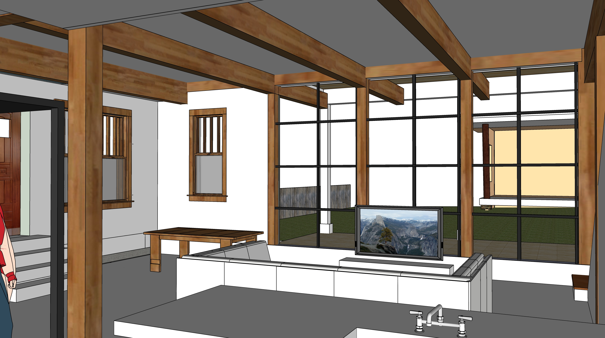</a>
   

<!--
<a href="img/livingroom-two-windows.jpg">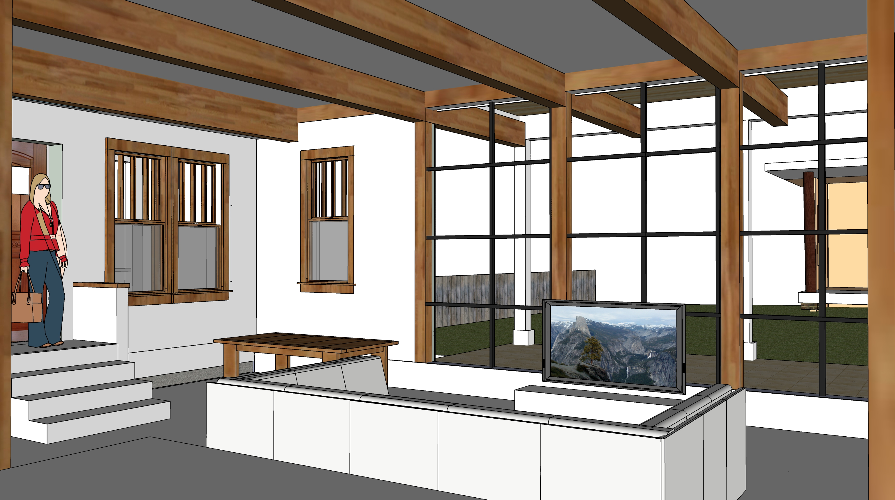</a>
   
-->

<h1 style="clear:both">Master Bedroom</h1>
<a href="../bedroom/img/bedroom.jpg">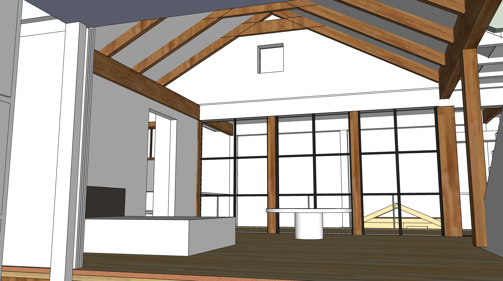</a>

   

<a href="img/REI.jpg">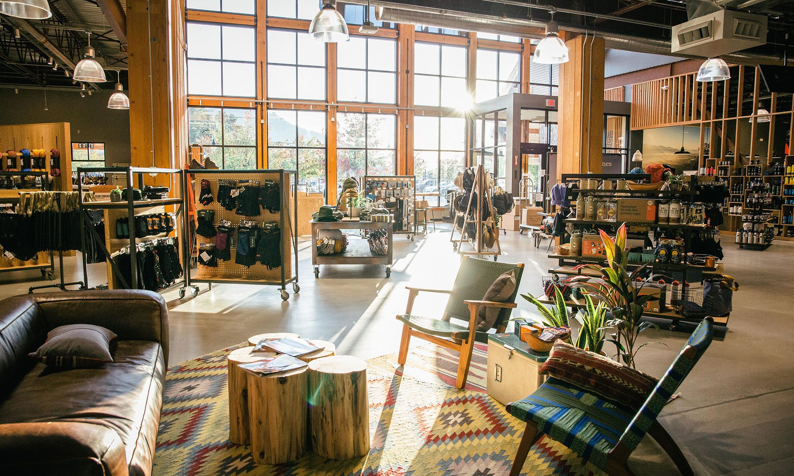</a> 

<!--
	Polyblend #11 Snow White 8 oz. Grout Renew Colorant

	https://www.homedepot.com/p/Custom-Building-Products-Polyblend-11-Snow-White-8-oz-Grout-Renew-Colorant-GCL11HPT/100133209

	How To:
	https://www.remodelaholic.com/dye-grout-refresh-dated-tile-floor/
-->

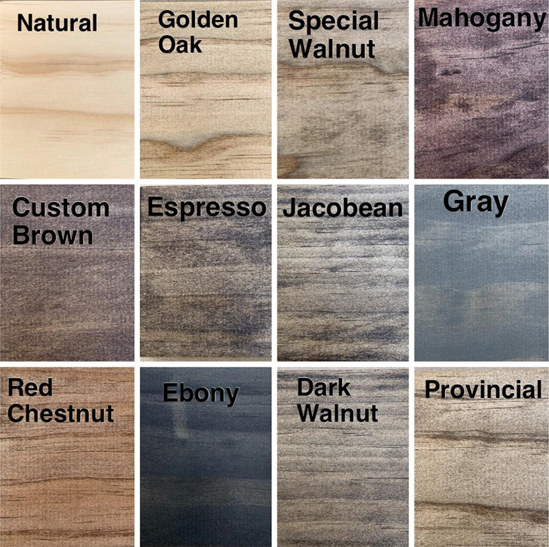 

White distressed wood stains to consider - Provincial, Farmhouse, Whitewashed Red Chestnut. Maybe some white distressed dark walnut. 
<a href="https://www.etsy.com/listing/903462334/wood-samples-wood-stain-sample-stain">Stain color source</a>

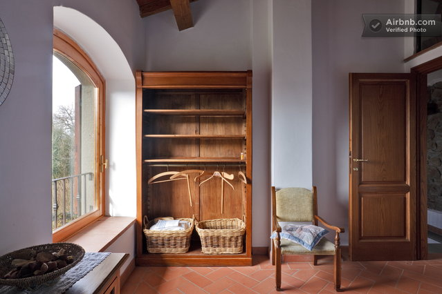 
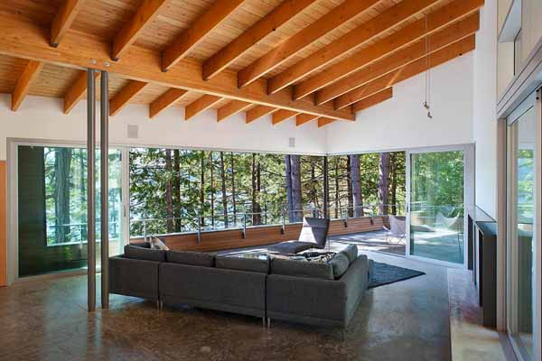 

Design south windows to have wide sill. Italian country design. Not too orange. Wood might be visible between beams. 

<!-- Lawrence’s beams are 24” on center for 4” by 8” --> 

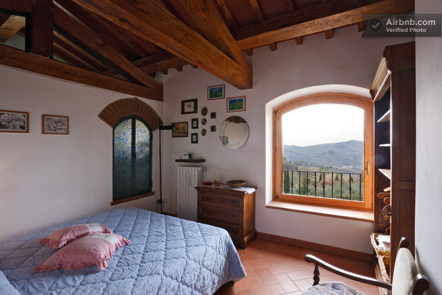  

Might put an arch at top of window behind tub by master bedroom.

## A passive home addition

Wrapped in extra insulation, from floor to roof  
Triple pane windows that should feel just as warm to the touch as the walls  

[Passive House Institute of the U.S.](https://www.phius.org/)  

<a name="minisplits">&nbsp;</a>

## Mini Split - Heating and Cooling

Two outside units on the north side will serve 3 interior units. 

- The master bedroom above south bathrooms. 
- The wall by south porch. (45 feet)  
- The downstairs kitchen above cabinets.  

<!-- the unfinished attic -->   

[Mitsubishi One-Way Ceiling Cassette](https://youtu.be/9qUhomNmfLs?t=551)  

[More Mitsubishi](https://www.mitsubishicomfort.com/ezfit/?campaign_id=31175&utm_source=Facebook&utm_medium=paid&utm_campaign=Comfort%20%7C%20Facebook%20%7C%20Website%20%7C%20National%20%7C%20EZFit%20%7C%202020&utm_term=EZFit-Yellow) 

<!-- Rob's are electric 1-to-1 and kept it warm when 4 degrees outside. -->

<a href="../bedroom/img/mini-above-bathrooms.jpg">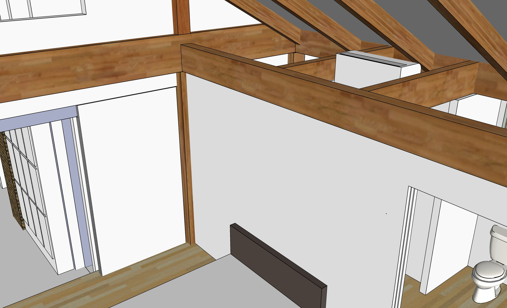</a>  

<a href="../livingroom/img/livingroom-mini-split.jpg">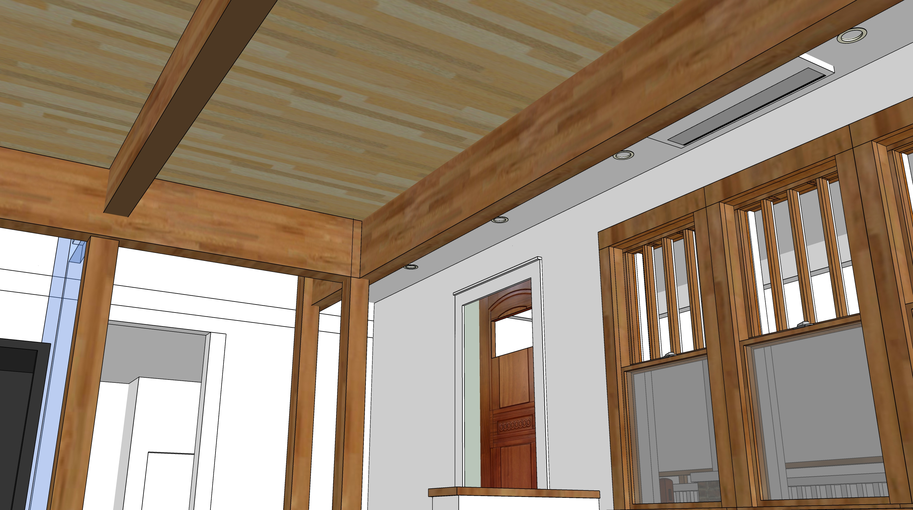</a>  

<a href="../kitchen/img/kitchen-mini-split.jpg">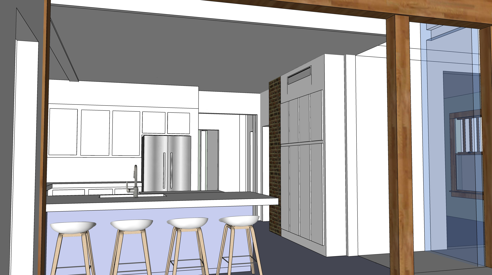</a>  

Air movement volumes delivered by a mini-split give no advantage to putting near floor, unless maybe you have a vented crawlspace.  Subsequently we should insulate kitchen floor in crawlspace. 

## STEP Warmfloor

STEP Warmfloor gives 2.5 times more heat output than cable systems, 2.08 times more heat output than hydronic systems, and up to 60% more efficient than conventional forced air systems.  

https://www.warmfloor.com/green-technology/sustainable-technology/

It could be placed under wood to create our gym-livingroom floor, rather than pouring more concrete on the hollow core slabs for hydronics. A thermal barrier between the basement slab and the element would add efficiency for a basement install. In the livingroom we would heat the slab during the day to radiate throughout the night, so no thermal barrier would be used under the livinging room floor surface.  

https://youtu.be/q2c8cLrZYkc?t=184

A thermal barrier between the slab and the element adds efficiency  

Insulation Recommendations - [from video](https://youtu.be/q2c8cLrZYkc?t=1507)  
- Rolled cork
- Cerazorb
- Healthy Choice sound solution pad

## Tankless Booster

A tankless booster will reside in kitchen by the sink and dish washer.  

A tankless water heater will reside by laundry machine upstairs.  

Terri's friend <a href="https://www.facebook.com/watch/live/?v=10160036402400436&ref=watch_permalink">Amy</a> presents a Rinnai Sensei tankless water heater, newer than Navien.  

Current gas powered tank water heater in the upstairs kitchen will be moved into the attic above north bathrooms.  

[Home](../)  

