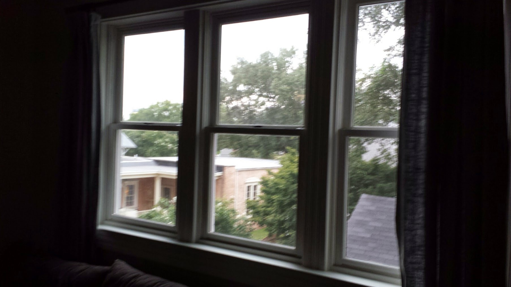

<!--

-->

 

  

Wood stain - White distressed, Provincial, Farmhouse, Whitewashed Red Chestnut. Maybe some white distressed dark walnut.

<!--
	Polyblend #11 Snow White 8 oz. Grout Renew Colorant

	https://www.homedepot.com/p/Custom-Building-Products-Polyblend-11-Snow-White-8-oz-Grout-Renew-Colorant-GCL11HPT/100133209

	How To:
	https://www.remodelaholic.com/dye-grout-refresh-dated-tile-floor/
-->

[wood color source](https://www.etsy.com/listing/903462334/wood-samples-wood-stain-sample-stain)  

Design south windows to have wide sill.
<!---->

Italian country design. Not too orange.

 
Yet to determine if wood will be visible between beams.
<!-- Lawrence’s beams are 24” on center for 4” by 8” --> 

  

[Home](../)  

