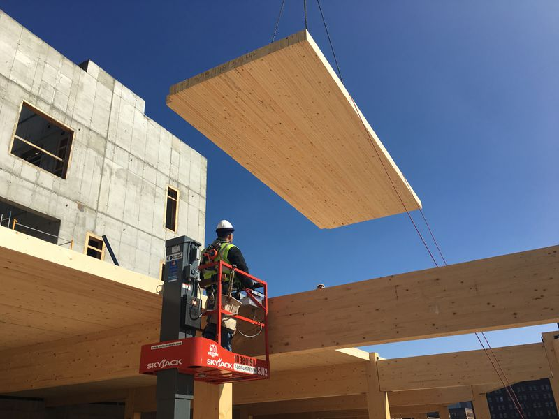

# Livingroom

<iframe width="560" height="315" src="https://www.youtube.com/embed/39HlLf85LG4?start=614" frameborder="0" allow="accelerometer; autoplay; encrypted-media; gyroscope; picture-in-picture" allowfullscreen></iframe>

### Super Strut Carriage
10 ft. 12-Gauge Half Slotted Metal Framing Strut Channel - Silver Galvanized  

<iframe width="560" height="315" src="https://www.youtube.com/embed/CgdsamzPN8w?start=132" frameborder="0" allow="accelerometer; autoplay; encrypted-media; gyroscope; picture-in-picture" allowfullscreen></iframe>  

We could have 4 super strut carriages from Home Depot, with four wheels below and four above. The motor is loud. We'd locate it in the attic.  

  

