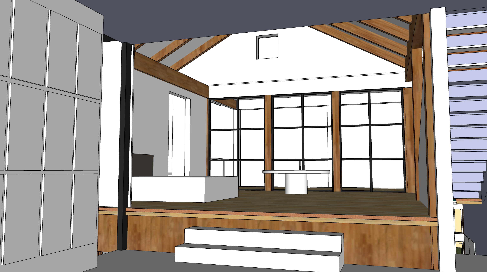

[Home](../) | [Phases](../phases/)

<h1>Livingroom</h1>

   

<!--

   
-->

<h1 style="clear:both">Master Bedroom</h1>

   

<!--

-->

 

<!--
	Polyblend #11 Snow White 8 oz. Grout Renew Colorant

	https://www.homedepot.com/p/Custom-Building-Products-Polyblend-11-Snow-White-8-oz-Grout-Renew-Colorant-GCL11HPT/100133209

	How To:
	https://www.remodelaholic.com/dye-grout-refresh-dated-tile-floor/
-->

 

White distressed wood stains to consider - Provincial, Farmhouse, Whitewashed Red Chestnut. Maybe some white distressed dark walnut. 
<a href="https://www.etsy.com/listing/903462334/wood-samples-wood-stain-sample-stain">Stain color source</a>

 
 

Design south windows to have wide sill. Italian country design. Not too orange. Wood might be visible between beams. 

<!-- Lawrence’s beams are 24” on center for 4” by 8” --> 

  

Might put an arch at top of window behind tub by master bedroom.

[Home](../)  

