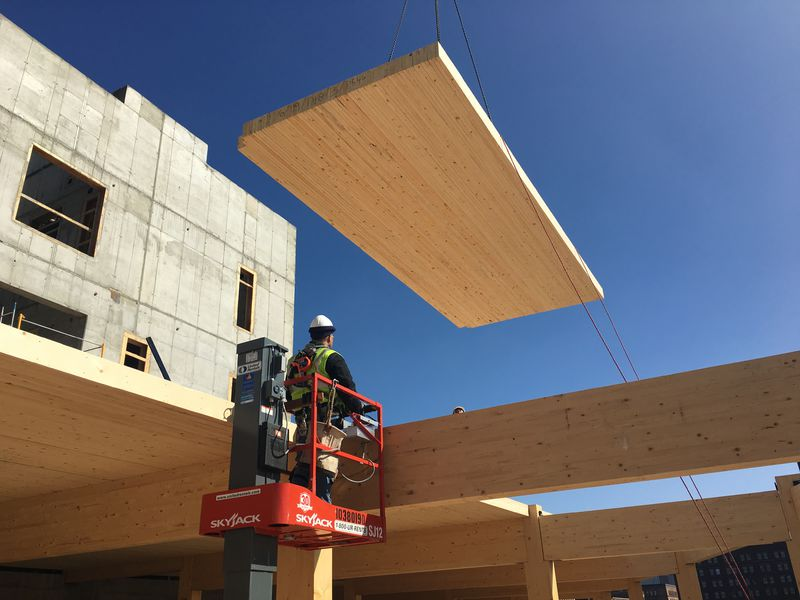
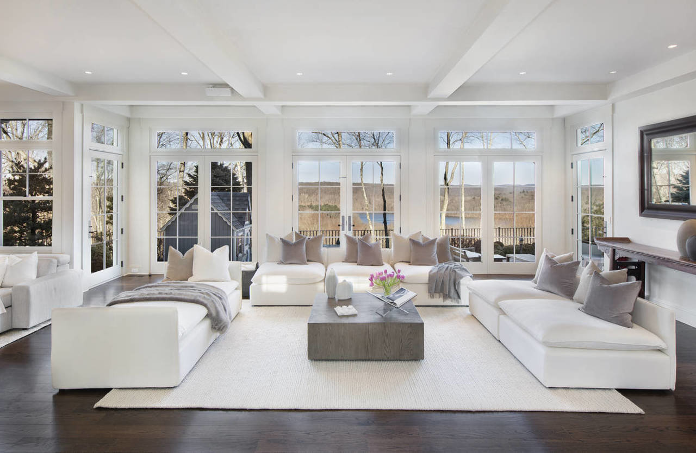

  

<h2>One Option</h2>

<a href="https://model.earth/community/projects/wood/">Mass Timber Panels (Dowel or Nail Laminated)</a>  
[Kendeda Living Building](https://livingbuilding.gatech.edu/) - [Kendeda News](https://livingbuilding.gatech.edu/news/wsj-georgia-techs-kendeda-building-pits-latest-sustainable-tech-against-atlantas-swampy-climate)  

