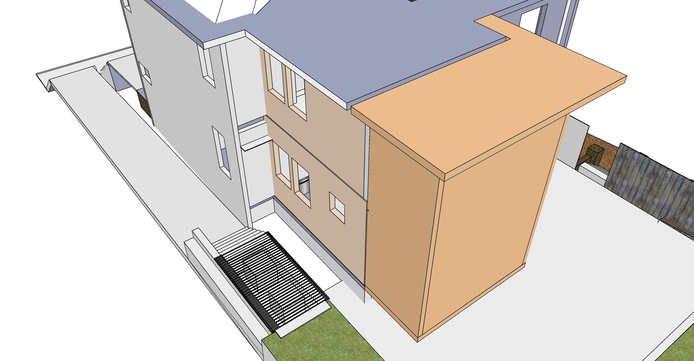

[721 Grant Street Addition](../)

# Construction Phases

<a href="sketchup/721-Grant-Street.skp">Download SketchUp Model</a>

Rough estimates for 12 construction phases, plus extras.  
Projects indicated as "(small)" may be done independently by home owner.

## Phase 1 - Remove Rear. Assemble Art Shed. Reposition AC Units.

| Art Shed. Remove Kitchen Ceilings. Cement AC Pad. Move AC Units | Min | Max |
|---|---|---|
| Art shed and AC grate planning | $500 | $1200 |
| Small adjacent freezer for new kitchen - Place upstairs (will move downstairs later) | $1,400 | $1,800 |
| Jackhammer existing north cement for AC pad. Remove cement.  (small)  | $400 | $800 |
| Pour cement pad for AC Units (small) | $600 | $800 |
| Cement bases for art shed footers (small) | $200 | $550 |
| Remove 1 of 2 west brick wall where trash resides. Bricks will be used for the shed footers (small) | $400 | $600 |
| 6 brick columns for shed. If short on bricks, some under portion being removed can be used (small) | $300 | $600 |
| Remove enough dirt for crane to enter backyard to avoid cutting trim limb | $600 | $1,000 |
| Remove top roof. Remove second floor windows and lower door. Separate rear structure from building. Remove rear stairway's top deck. Move lower section as one unit. Add 4x4s to reinforce open side. <a href="shed">Flip shed</a> or use crane. | $2,000 | $5,000 |
| Chainsaw tree too close to the other and guide down with ropes or crane. Cut up large pieces. | $500 | $800 |
| Weather-seal upper edge of house after removal. Attach gutter. Cleanup. (Old siding remains) | $200 | $800 |
| Assemble art shed. Wood from rear wall of kitchens can be used later (small) | $1,000 | $2,000 |
| Cut up renaining branches of downed tree (small) | $200 | $300 |
| Remove ceiling and south wall in both kitchens. Truck to cart off mortar and backing wood. (small) | $800 | $1,500 |
| Move AC Units, extend freon lines | $600 | $800 |
| Purchase and install weatherproof west door to crawl space for existing hole under removed rear. About 2' tall by 3.5' wide | $400 | $800 |
| Repoint existing bricks (north side is done), repair crawlsoace vent openings, patch wood holes. | $1,000 | $2,000 |

  

  
 

## Phase 2 - Basement and Brickwork

<!--
Basement Framing and Pour
Possible resource: Fernando Garcia 404-538-2458 - Basement on Georgia Ave (July 2014) - Don't remember which house.
-->

| Cement work, window within basement, sliding basement entrance |||
|---|---|---|
| Rear porch 3 cement pedestal bases (small) | $200 | $400 |
| Basement Dig, Frame and Pour - includes sump pump and a few feet of drain pipe  | $10,000 | $30,000 |
| North bump-out foundation cement pour at same time | $2,000 | $4,000 |
| Drain pipe by porch - perforated, wrapped in screen in a bed of gravel inches from addition | $400 | $500 |
| Pour cement steps on Bass Street | $1,000 | $2,500 |
| Grate over HVAC units | $800 | $1,500 |
| Hollow core slabs, probably use crane | $15,000 | $25,000 |
| Weatherproof plywood cover over basement stair opening, secure from below (small) | $100 | $200 |
| Metal stairway in basement | $1,000 | $4,000 |
| Basement window under porch. Black frame, an old factory look. Slides or swings open fully.  | $900 | $1,400 |
| Thick porch tiles laid out for rain absorption as back porch (small) | $400 | $800 |
| Rain barrels and pipe hookup under south steps | $1,000 | $1,500 |
| Drains from brick porch area down to street, drain going east next to short brick wall | $800 | $1,500
| Brick patio portion of porch area, sand under bricks, weed barrier fabric | $300 | $500 |
| Reset sidewalk, create side slope away from basement, weed barrier, 

sand to absorb water, careful with roots | $800 | $1000 |
| Brick walls of porch | $1000 | $3000 |
| Basement sliding doors adjacent to sidewalk | $2,000 | $5,000 |
| Wooden porch steps - detachable, over rain barrels | $500 | $700 |
| Install tiny door, install tiny sunburst (Abbey) |  |  |

  
 

## Phase 3 - Framework, Roof, Stairways, Windows, Siding, Electric
||||
|---|---|---|
| "Base Isolated" House - pads to dampen earthquake vibration | $200 | $1,000 |
| Framework including porch railings and lower kitchen extension | $20,000 | $50,000 |
| Roofing for entire house (white surface for solar, close existing attic vent) | $8,000 | $20,000 |
| 2 new wooden staircases - main floor and to attic (includes install of treads and banisters after drywall and painting) | $3,800 | $7,000 |
| Purchase and place grey water tanks above master bedroom | $800 | $1,500 |
| Remove old roof under newly added shed roof. Remove pulldown attic stairway. Create balcony by extending attic beams over new jut-out. | $3,000 | $4,500 |
| 31 windows, including window between attic and master bedroom. 2 exterior doors. | $18,000 | $25,000 |
| Consider triple pane windows with argon fill - maybe on north side. |||
| Siding on addition | $8,000 | $10,000 | 
| Separate fuse boxes for new electric work. “Whole-house protector” in basement. | $500 | $1,000 |
| Electrical work and lighting | $8,000 | $15,000 |
| Strong metal doors on two north storage compartments | $400 | $1,000 |
| Move all existing wires to new fuse boxes (upstairs and down) | $2,000 | $5,000 |
| And new waterproof window interior to existing upstairs bathroom | $800 | $1,500 |
| Craft room walls and ceiling, move door frame | $800 | $1,000 |
 
  
 

## Phase 4 - Painting Exterior, Replace Existing Storm Windows
|  |||
|---|---|---|
| Remove old storm windows and security bars, patch and repair | $800 | $2,000 |
| Prep and paint entire exterior | $8,000 | $15,000 |
| Add white storm windows - include some that open automatically with Google Home. | $10,000 | $18,000 |

## Phase 5 - Plumbing, Ductwork and Air
| AC Ducts, Grey water system, 2 AC Units, 1 Heating unit in basement |||
|---|---|---|
| Ducts to kitchens and bathrooms, including duct up elevator shaft | $2,500 | $5,000 |
| North attic wall AC unit | $2,500 | $3,500 |
| Move water heater to attic. Hook up water and gas lines (small) | $700 | $900 |
| Grey water system - use copper entry basin for water entrance from shed roof | $3,000 | $4,000 |
| Kitchen and craft room vent covers, bathroom vent covers (small) | $300 | $500 |
| Plumbing for location of new sink in craft room | $100 | $200 |
| Plumbing for new upstairs bathrooms | $1,200 | $3,000 |
| Air heating unit in basement integrated with Hollow Core loops | $4,000 | $6,000 |
| AC Unit in south porch roof | $1,800 | $3,000 |

## Phase 6 - Drywall, Interior Trim, Interior Painting, Stairway Completion
| Interior Trim and Door Carpentry |||
|---|---|---|
| Expand window opening for doorway to new bathroom from center room (small) | $200 | $300 |
| Add closet to existing center room, hang bathroom door  | $800 | $2,000 |
| Drywall new addition and craft room | $3,000 | $5,000 |
| Interior painting | $2,000 | $4,000 |
| Vent covers and switch covers (small) | $400 | $700 |
| Build 3 step wood stairway and landing at south entrance interior | $900 | $1,200 |
| Build 3 step wood stairway to master bedroom | $500 | $800 |
| Build 3 step wood stairway to new bathrooms | $400 | $600 |
| Build bathroom door frame from our wood trim collection. Hang door use 1 of 5 in attic | $500 | $800 |
| Large sliding bathroom door | $800 | $1,200 |
| 4 large sliding screens (shoji) between master bedroom and craft room (8'7" by 4'5") | $1,200 | $3,000 |
| Existing crawl space door, sand, and trim and lock. Dark stain color to blend with bricks | $300 | $500 |
| Stairway treads and banisters (billed in phase 3) |||

## Phase 7 - Solar Panels
| New rebates are expected. List of [solar contractors in Georgia](https://www.solarpowerworldonline.com/2020-top-georgia-contractors/)  |||
|---|---|---|
| Solar panels  | $20,000 | $30,000 |

## Phase 8 - Craft Room Shelf, Sink and Counter
|  Craft room can optionally serve as a second kitchen |||
|---|---|---|
| Tile wall in craftroom | $1,000 | $1,500 |
| Craft room shelf | $400 | $600 |
| Disconnect upstairs kitchen sink | $50 | $100 |
| New upstairs counter with sink in craft room | $1,000 | $1,500 |
| Connect plumbing (small) | $50 | $150 |
<a href="../kitchen/#craftroom">Craft Room Images</a> 

## Phase 9 - New Bathrooms
| Upstairs, south side of addition |||
|---|---|---|
| South upstairs bathroom fixtures, shelf-cabinets and laundry area | $10,000 | $15,000 |
| Cabinet-closet in master bedroom | $500 | $800 |

  
 

## Phase 10 - New Kitchen, Cabinetry
| Downstairs kitchen remodel |||
|---|---|---|
| Deactivate existing plumbing, electric, remove counters and wall behind sink (small) | $400 | $500 |
| Extend kitchen floor surface 3' into bumpout and resurface floor | $3,000 | $4,000 |
| Tile and drywall | $1,000 | $1,300 |
| Downstairs kitchen oven and hood | $1,200 | $3,000 |
| Downstairs kitchen - counter. cabinets including south wall, sink, hookup dishwasher | $7,000 | $15,000 |
| Upstairs craft room - cabinet on south wall | $1,500 | $1,800 |

  
 
<a href="../kitchen/">More Kitchen Images</a> 

## Phase 11 - Exterior Fireplace
| Porch fireplace grill provides heat to house |||
|---|---|---|
| Barbecue grill with stone enclosure | $3,000 | $8,000 |
| Porch fireplace top with ducts connected to hollow core loop | $1,000 | $3,000 |

## Phase 12 - Existing Stairway, Existing Bathrooms
|  |||
|---|---|---|
| Move existing front stairway (small) | $1,000 | $2,000 |
| New light(s) in existing stairway, update existing switches to be two-way (small) | $400 | $800 |
| Existing upstairs bathroom - move sink and toilet mount, new wall mounted toilet, add tub (small) - [Wall photos](https://docs.google.com/document/d/1J0A26a7-Dvm3mscBRTSgxIeMxft11VZoRADT_unegkE/edit?usp=sharing) | $4,000 | $8,000 |
| Add downstairs shower under stairway (small) | $1,500 | $3,500 |

## Extras
| Optional, not in financing |||
|---|---|---|
| Existing front porches - New ceilings with recessed lighting, dimmer, remove extra columns, surrounding molding, trim repairs  | $800 | $3,000 |
| Upstairs center bedroom - 6 lights with one dimmer switch (probably 3’ from corners) | $500 | $800 |
| Light-well material using elevator shaft | $2,000 | $6,000 |
| <a href="https://docs.google.com/document/d/12DIpuRJvCAZmODl7M-jmEJEsM0hCdxiBljkXsaRpKSs/edit?usp=sharing">Crawl Space Encapsulation</a> | $2,000 | $5,000 |
| Basement chiller, fan and duct in elevator shaft | $4,000 | $8,000 |
| Elevator with motors below base, track for gears. Serves 4 levels | $10,000 | $18,000 |
| Four elevator-bots shuffled in attic for sets of clothes and shoes  | $10,000 | $15,000 |

 

 
---

# Basement Details

## Low Carbon Emission Concrete

Atlanta-based Thomas Concrete has been using the Canadian CarbonCure system since 2016.
[CNN Article](https://money.cnn.com/2018/06/12/technology/concrete-carboncure/index.html)  

"CarbonCure involves injecting carbon dioxide captured from various other industrial processes into concrete during the mixing process. A chemical reaction would “mineralize” that carbon dioxide, which would have the added benefit of making the concrete compressively stronger." “We have seen no downsides to using CarbonCure,”  Drew Millwood, the Thomas Concrete technician who oversaw the Kendeda job, writes: “It allows for cement reduction in any mix it is used in and provides strength at or above design. No cost increase is involved in a mix containing CO2 as the savings from cement reduction offset the cost of CO2 delivery. Equipment costs are easily recouped due to the savings.” - [source](https://livingbuilding.kendedafund.org/2019/07/16/carboncure/)  

## Hollow Core Concrete Slabs

  
 

Hollow Core slabs will provide a heat-sink in the main floor, storing heat generated from solar energy to radiate out at night.  

8” slab + 2” concrete topping. 10” total.  

 2” Acid Wash Cement cover (Structural, composite concrete topping)

 <!--
 	Coreslab Structure (Atlanta) - Met Sales Rep Jay Rubinson jrubinson@coreslab.com 770-471-1150

 	Metal stairway version in SketchUp (nned to update height): 
	Industrial Stairway with 105" landing height and 36" width. 
	Factory Supply part number ISO105-36.

 -->
  

  

[Concrete Industries - Indiana](https://concreteindustries.com/hollowcore/)
**Specs**  
[8" Hollowcore with 2" composite topping](https://concreteindustries.com/wp-content/uploads/2017/07/Hollowcore-Load-Table-2in-Composite.pdf)  
[8" Hollowcore with no composite topping](https://concreteindustries.com/wp-content/uploads/2017/07/Hollowcore-Load-Table-No-Composite.pdf)
  

 

PCM placed in hollow core tubes as a thermal storage and supply system <a href="https://www.sciencedirect.com/science/article/abs/pii/S0378778815300591">PCM Research</a> 
Note that external air is NOT sent through the hollow core slab. Air moves in a loop.
  

  
Air flow leaves the electric heating unit on the right side, move though hollow core basement ceiling, and return for reheating via the left duct.   

  
U-shaped pipes would connect sets of two pipes to create ten 50 foot loops. Air circulating through slabs would not be mixed with home air.
  

<!--
Student researcher explaining an innovative [seismic retrofit](https://www.constructionspecifier.com/new-research-council-formed-for-concrete-industry/). 
Send suggestions to [ACI Foundation](https://www.acifoundation.org/research/suggestresearch.aspx)  

-->

### Sources of Precast Concrete for Hollow Core

[Precast Concrete Suppliers serving Georgia](https://www.thomasnet.com/georgia/precast-concrete-17311002-1.html)  

[Precast Concrete Directory](https://www.pci.org/PCI/Directories/PCICertifiedPlants.aspx)  

### Concrete with Cellulose Nanocrystals

Cellulose nanocrystals provide an avenue for water to hydrate cement particles when mixing.  

Cellulose-infused concrete is stronger and sets faster  

[Purdue Researchers](https://www.purdue.edu/newsroom/releases/2018/Q1/purdue-researchers-show-concrete-infused-with-wood-nanocrystals-is-stronger,-plan-to-use-it-in-california-bridge.html)  
[Thomas parking lot in Greenville](http://www.thomasconcrete.com/latest-news/thomas-concrete-partners-in-the-debut-of-a-concrete-mix-infused-with-cellulosic-nanomaterial)  

<!--
ICF insulated concrete foundation
ICF Builder
-->

## Exterior Fireplace
The fireplace will convert from a range to a pit for burning wood.
  
  

Enclosed air tubes in the top of fireplace will connect to the basement loop to circulate heat into floor slabs.  
The tube will snake through the top of the fireplace, so air with ashes is not mixing with the house loop.
  
  

## Repointing Bricks

Sandstone mortar color, similar to left below. [Mortar Mix for Historic Homes](https://gpna.org/historic-home-care)  

 
  

A color more like our existing wall below than the red existing mortar...  

  
  

## AC Units, Grey Water Storage

### 5 sources of cold air
<!--A means to avoid duct work applied at the Kendeda Living Building.  -->

The home's two existing HVAC units will reside under a grate on the north side of the house. 

An attic AC unit will connect to ducts and the central elevator shaft.

A small AC unit will also reside within the ceiling of the south facing porch.  
 
Chiller/freezer unit in the basement will pump cold air up a duct within the elevator shaft.  
<!-- Radiant pumping, chiller and air-handling unit. -->

<!--
Not using - Water Furnace Specs
https://www.waterfurnace.com/literature/envision/im1008hn.pdf
-->

  
 

About <a href="https://www.hpacmag.com/features/radiant-cooling/">radiant-cooling</a>  

Plans do not yet include location for “influx of fresh air” to stimulate building temperatures. Probably need to run through a dehumidifier.  

### HVAC Duct Fabricators
Atlanta Supply - Logan Circle (for Ducts, custom)  
Custom sheet metal (pricey) [B & S Sheet Metal Fabricators Inc.](https://bsmetalfabricators.com/)  

Current HVAC in crawl space: Ducane  
Sept 2014 - Circuit board replaced  
Motor did not need to be replaced (m#FPBB100A5 S#20251005A PRODUCT#1006559993) 

<h2>West Elevation</h2> 
Cold air enters at upper left AC.  
Hot air generated in the basement, lower left. Air loops through concrete slabs as heat-sink while solar operational.
  

 
## Tankless Water Heaters

2 Tankless - One by laundry machine, one in basement by kitchen  

<a href="https://www.facebook.com/watch/live/?v=10160036402400436&ref=watch_permalink">Amy</a> presents a Rinnai Sensei tankless water heater, newer than Navien.  

Tank in the upstairs kitchen will be moved into the attic above north bathroom.
<!-- 
<a href="http://www.marathonheaters.com/cons_specs.html">Rheem's Marathon Water Heater</a> - "The most durable electric water heater" - Under stairs  
-->

## Electrical

Recessed can lights (pot lights) will be used in all rooms.

<b>Resources</b>  
<a href="https://www.edrawmax.com/article/electrical-plan.html">How to layout electrical plan</a>  
<a href="https://3dwarehouse.sketchup.com/model/18515e9750cb23076d022864d00430d0/Electrical-Components?redirect=1">SketchUp Electrical Components</a>  

## Porch Railing Style

Not our house. For reference only...  

 

Waterflow at porch...  

 

---

[Home](../)

