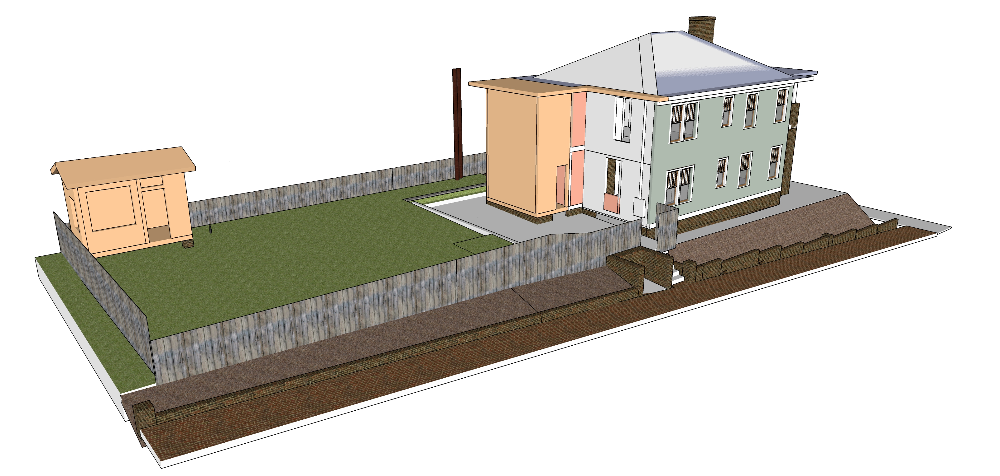
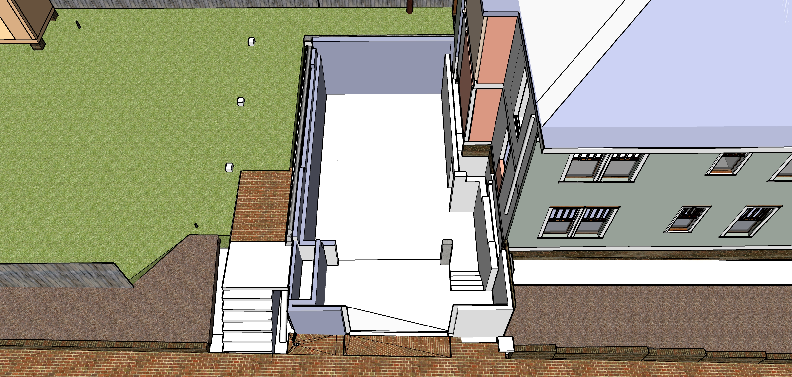
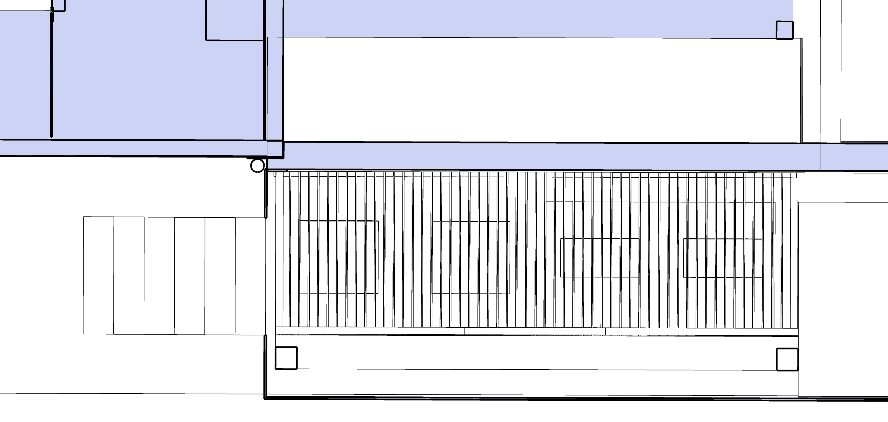
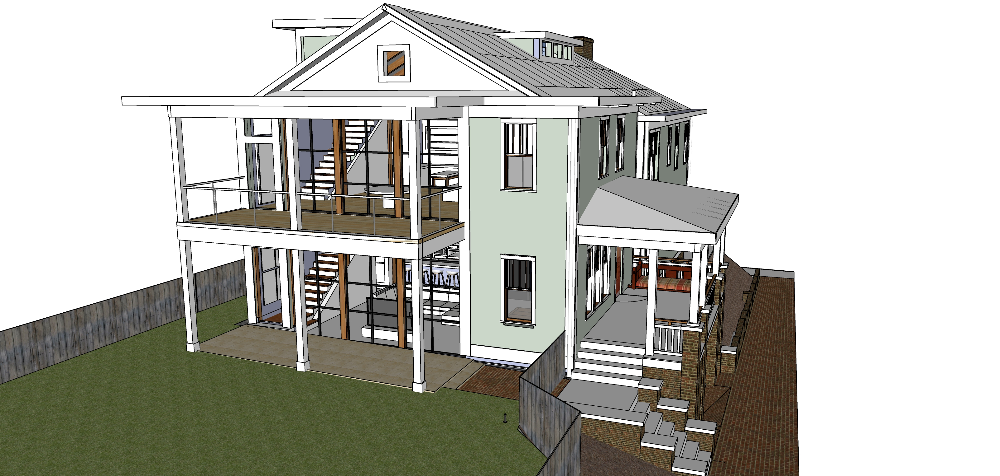

[721 Grant Street Addition](../)

<!--
Renovation Construction Loan
Based on value of home at time of project completion
-->
# Construction Phases

<a href="sketchup/721-Grant-Street.skp">Download SketchUp Model</a>

Rough estimates for construction phases, plus extras.  
Projects indicated as "(small)" may be done independently by home owner.

## Phase 1 - Convert Rear into Art Shed. Remove Concrete.

| Art Shed. Remove Kitchen Ceilings. Cement AC Pad. Move AC Units | Min | Max |
|---|---|---|
| Cement bases for art shed footers (small) | $200 | $550 |
| 6 brick columns for shed. If short on bricks, bricks from trash area can be used (small) | $300 | $600 |
| Optional: Remove enough dirt for crane to enter backyard | $600 | $1,000 |
| Remove top roof. Remove second floor windows and lower door. Separate rear structure from building. | | |
| Remove rear stairway's top deck. (small) | | |
| Add 4x4s to reinforce open side. <a href="shed">Flip shed</a> or use crane. | | |
| Move lower section as one unit. | $2,000 | $5,000 |
| Weather-seal upper edge of house after removal. Attach gutter. Cleanup. (Old siding remains) | $200 | $800 |
| Assemble art shed. Wood from rear wall of kitchens can be used later (small) | $1,000 | $2,000 |
| **Remove Kitchen Interior Wall and Ceiling** | | |
| Remove ceiling and south wall in downstairs kitchens. Truck to cart off mortar and backing wood. (small) | $600 | $800 |
| Cabinet-size freezer for new kitchen - Place upstairs as island initially | $1,400 | $1,800 |
| Install removable weather barrier for crawl space at existing hole under removed rear. About 2' tall by 3.5' wide | $400 | $500 |
| Repoint existing bricks, repair crawlsoace vent openings, patch wood holes. | $1,400 | $2,000 |
| **Remove tree too close to other tree** | | |
| Chainsaw tree too close to the other and guide down with ropes or crane. Cut up large pieces. | $500 | $800 |
| Cut up remaining branches of downed tree (small) | $200 | $300 |
  

Rear laundry area to be removed and converted into art shed: 
  
 
 
Protecting large trees.  Tree to be removed is smaller - between these two at northwest corner of house.
 

## Phase 2 - Basement, Drainage and Brickwork

<!--
Basement Framing and Pour
Possible resource: Fernando Garcia 404-538-2458 - Basement on Georgia Ave (July 2014) - Don't remember which house.
-->

| Cement work, window within basement, sliding basement entrance |||
|---|---|---|
| Jackhammer existing north cement for AC pad. Remove cement.  (small)  | $400 | $800 |
| Remove remaining brick wall where trash resides. Retain bricks for reuse (small) | $400 | $600 |
| Remove slate rear patio | | |
| **Basement/Cement Work** | | |
| Pour cement pad for AC Units (small) | $600 | $800 |
| Rear porch 3 cement pedestal bases (small) | $200 | $400 |
| Basement Dig, Frame and Pour - includes sump pump and a few feet of drain pipe  | $10,000 | $30,000 |
| North bump-out foundation cement pour at same time | $2,000 | $4,000 |
| Cemeent drain by porch with grate to catch leaves | $400 | $500 |
| Drains from brick porch area down to street below entrance, drain going east next to short brick wall | $800 | $1,500
| Pour higher basement level, 2 sets of cement steps and backing for brick walls on Bass Street | $1,000 | $2,500 |
| Brick patio area above stairway, sand under bricks, weed barrier fabric | $300 | $500 |
| Reset sidewalk (center third of Bass frontage, create side slope away from basement, weed barrier. (Other areas of Bass Street have vulnerable trees, so avoid resetting bricks by 2 oak trees and at front of property by Grant Street) | $800 | $1000 |
| Brick walls of porch | $1000 | $2000 |
| **Hollow Core Delivery:** | | |
| Hollow core slabs, lifted into place by crane on truck | $15,000 | $25,000 |
| Weatherproof plywood cover over basement stair opening, secure from below (small) | $100 | $200 |

  
 
  
<!--
 
  
-->
 
  

## Phase 3 - Reposition 2 exterior AC Units.  Add Grate over Units

| AC Units, Install Mini-split in Downstairs Kitchen |||
|---|---|---|
| Move AC Units, extend freon lines | $600 | $800 |
| Install Mini-split in Downstairs Kitchen | $1,500 | $2,000 | 
| Grate over HVAC units | $800 | $1,500 |
| **Basement Details:** | | |
| Metal stairway in basement | $1,000 | $4,000 |
| Basement window under porch. Black frame, an old factory look. Slides or swings open fully.  | $900 | $1,400 |
| Basement sliding doors adjacent to sidewalk | $2,000 | $5,000 |
| **Exterior Detail Work:** | | |
| Wooden porch steps - detachable, over rain barrels | $500 | $700 |
| Thick porch tiles laid out for rain absorption as back porch (small) | $400 | $800 |
| Rain barrels and pipe hookup under south steps | $1,000 | $2,500 |
| Install tiny door, install tiny sunburst (Abbey) |  |  |

  
  
 

  
  

**Basement Details**
 
  

## Phase 4 - Framework, Roof, Stairways, Windows, Siding, Electric
||||
|---|---|---|
| "Base Isolated" House - pads to dampen earthquake vibration | $500 | $1,000 |
| Framework including porch railings and lower kitchen extension | $20,000 | $50,000 |
| Roofing for entire house (white surface for solar, close existing attic vent) | $8,000 | $20,000 |
| 2 new wooden staircases - main floor and to attic (includes install of treads and banisters after drywall and painting) | $3,800 | $7,000 |
| Purchase and place grey water tanks above master bedroom | $800 | $1,500 |
| Remove old roof under newly added shed roof. Remove pulldown attic stairway. Create balcony by extending attic beams over new jut-out. | $3,000 | $4,500 |
| 31 windows, including window between attic and master bedroom. 2 exterior doors. | $18,000 | $25,000 |
| Consider triple pane windows with argon fill - maybe on north side. |||
| Siding on addition | $8,000 | $10,000 | 
| Separate fuse boxes for new electric work. “Whole-house protector” $178 on Amazon for 140,000 amp Siemens FS140 Whole House Surge Protector. | $500 | $1,000 |
| Electrical work and lighting | $8,000 | $15,000 |
| Strong metal doors on two north storage compartments | $400 | $1,000 |
| Move all existing wires to new fuse boxes (upstairs and down) | $2,000 | $5,000 |
| And new waterproof window interior to existing upstairs bathroom | $800 | $1,500 |
| Craft room walls and ceiling, move door frame | $800 | $1,000 |
 
  
 

  
 

## Phase 4 - Painting Exterior, Replace Existing Storm Windows
|  |||
|---|---|---|
| Remove old storm windows and security bars, patch and repair | $800 | $2,000 |
| Prep and paint entire exterior | $8,000 | $15,000 |
| Add white storm windows - include some that open automatically with Google Home. | $10,000 | $18,000 |

## Phase 5 - Plumbing, Ductwork and Air
| AC Ducts, Grey water system, 2 AC Units, 1 Heating unit in basement |||
|---|---|---|
| Ducts to kitchens and bathrooms, including duct up elevator shaft | $2,500 | $5,000 |
| North attic wall AC unit | $2,500 | $3,500 |
| Move water heater to attic. Hook up water and gas lines (small) | $700 | $900 |
| Grey water system - use copper entry basin for water entrance from shed roof | $3,000 | $4,000 |
| Kitchen and craft room vent covers, bathroom vent covers (small) | $300 | $500 |
| Plumbing for location of new sink in craft room | $100 | $200 |
| Plumbing for new upstairs bathrooms | $1,200 | $3,000 |
| Air heating unit in basement integrated with Hollow Core loops | $4,000 | $6,000 |
| AC Unit in south porch roof | $1,800 | $3,000 |

## Phase 6 - Drywall, Interior Trim, Interior Painting, Stairway Completion
| Interior Trim and Door Carpentry |||
|---|---|---|
| Expand window opening for doorway to new bathroom from center room (small) | $200 | $300 |
| Add closet to existing center room upstairs, hang bathroom door  | $800 | $2,000 |
| Drywall new addition and craft room | $3,000 | $5,000 |
| Interior painting | $2,000 | $4,000 |
| Vent covers and switch covers (small) | $400 | $700 |
| Build 3 step wood stairway and landing at south entrance interior | $900 | $1,200 |
| Build 3 step wood stairway to master bedroom | $500 | $800 |
| Build 3 step wood stairway to new bathrooms | $400 | $600 |
| Build bathroom door frame from our wood trim collection. Hang door use 1 of 5 in attic | $500 | $800 |
| Large sliding bathroom door | $800 | $1,200 |
| 4 large sliding screens (shoji) between master bedroom and craft room (8'7" by 4'5") | $1,200 | $3,000 |
| Existing crawl space door - replace plywood with verticle boards. sand, stain and seal and lock. Dark stain color to blend with bricks | $300 | $500 |
| Stairway treads and banisters (continued from phase 3) | $ | $|
| Door Hardware - Repair/upgrade doorknobs - Front door, bedroom, upstairs bathroom | $400 | $800 |
| &nbsp; |||

## Phase 7 - Solar Panels
| New rebates are expected. List of [solar contractors in Georgia](https://www.solarpowerworldonline.com/2020-top-georgia-contractors/)  |||
|---|---|---|
| Solar panels  | $20,000 | $30,000 |

## Phase 8 - Craft Room Shelf, Sink and Counter
|  Craft room can optionally serve as a second kitchen |||
|---|---|---|
| Tile wall in craftroom | $1,000 | $1,500 |
| Craft room shelf | $400 | $600 |
| Disconnect upstairs kitchen sink | $50 | $100 |
| New upstairs counter with sink in craft room | $1,000 | $1,500 |
| Connect plumbing (small) | $50 | $150 |
<a href="../kitchen/#craftroom">Craft Room Images</a> 

## Phase 9 - New Bathrooms
| Upstairs, south side of addition |||
|---|---|---|
| South upstairs bathroom fixtures, shelf-cabinets and laundry area | $10,000 | $15,000 |
| Cabinet-closet in master bedroom | $500 | $800 |

  
 

## Phase 10 - New Kitchen, Cabinetry
| Downstairs kitchen remodel |||
|---|---|---|
| Deactivate existing plumbing, electric, remove counters and wall behind sink (small) | $400 | $500 |
| Extend kitchen floor surface 3' into bumpout and resurface floor | $3,000 | $4,000 |
| Tile and drywall | $1,000 | $1,300 |
| Downstairs kitchen oven and hood | $1,200 | $3,000 |
| Downstairs kitchen - counter. cabinets including south wall, sink, hookup dishwasher | $7,000 | $15,000 |
| Upstairs craft room - cabinet on south wall | $1,500 | $1,800 |

  
 
<a href="../kitchen/">More Kitchen Images</a> 

## Phase 12 - Exterior Wood Structures

  
 

## Phase 13 - Exterior Fireplace
| Porch fireplace grill provides heat to house |||
|---|---|---|
| Barbecue grill with stone enclosure | $3,000 | $8,000 |
| Porch fireplace top with heat-transfer pipes connected to hollow core loop | $1,000 | $3,000 |

## Extras
| Optional, not in financing |||
|---|---|---|
| Existing front porches - remove 2 extra columns by bricks and add 2x11 in ceiling, new ceilings with recessed lighting, dimmer. Add molding. Trim repairs.  | $800 | $3,000 |
| Upstairs center bedroom - 6 lights with one dimmer switch (probably 3’ from corners) | $500 | $800 |
| Light-well material using elevator shaft | $2,000 | $6,000 |
| <a href="https://docs.google.com/document/d/12DIpuRJvCAZmODl7M-jmEJEsM0hCdxiBljkXsaRpKSs/edit?usp=sharing">Crawl Space Encapsulation</a> | $2,000 | $5,000 |
| Basement chiller, fan and duct in elevator shaft | $4,000 | $8,000 |
| Elevator with motors below base, track for gears. Serves 4 levels | $10,000 | $18,000 |
| Four elevator-bots shuffled in attic for sets of clothes and shoes  | $10,000 | $15,000 |

 

 
---

# Basement Details

## Low Carbon Emission Concrete

Atlanta-based Thomas Concrete has been using the Canadian CarbonCure system since 2016.
[CNN Article](https://money.cnn.com/2018/06/12/technology/concrete-carboncure/index.html)  

"CarbonCure involves injecting carbon dioxide captured from various other industrial processes into concrete during the mixing process. A chemical reaction would “mineralize” that carbon dioxide, which would have the added benefit of making the concrete compressively stronger." “We have seen no downsides to using CarbonCure,”  Drew Millwood, the Thomas Concrete technician who oversaw the Kendeda job, writes: “It allows for cement reduction in any mix it is used in and provides strength at or above design. No cost increase is involved in a mix containing CO2 as the savings from cement reduction offset the cost of CO2 delivery. Equipment costs are easily recouped due to the savings.” - [source](https://livingbuilding.kendedafund.org/2019/07/16/carboncure/)  

## Hollow Core Concrete Slabs

<!--
  
 
-->
8” slab + 2” concrete topping. 10” total.  

Hollow Core slabs could provide a heat-sink in the main floor, storing heat generated from solar energy to radiate out at night.  Likely to use electric on basement floor to heat basement ceiling slab from below.

  

  

[Concrete Industries - Indiana](https://concreteindustries.com/hollowcore/)
**Specs**  
[8" Hollowcore with 2" composite topping](https://concreteindustries.com/wp-content/uploads/2017/07/Hollowcore-Load-Table-2in-Composite.pdf)  
[8" Hollowcore with no composite topping](https://concreteindustries.com/wp-content/uploads/2017/07/Hollowcore-Load-Table-No-Composite.pdf)
  

<!--
 
-->

### Sources of Precast Concrete for Hollow Core

[Precast Concrete Suppliers serving Georgia](https://www.thomasnet.com/georgia/precast-concrete-17311002-1.html)  

[Precast Concrete Directory](https://www.pci.org/PCI/Directories/PCICertifiedPlants.aspx)  

### Concrete with Cellulose Nanocrystals

Cellulose nanocrystals provide an avenue for water to hydrate cement particles when mixing.  

Cellulose-infused concrete is stronger and sets faster  

[Purdue Researchers](https://www.purdue.edu/newsroom/releases/2018/Q1/purdue-researchers-show-concrete-infused-with-wood-nanocrystals-is-stronger,-plan-to-use-it-in-california-bridge.html)  
[Thomas parking lot in Greenville](http://www.thomasconcrete.com/latest-news/thomas-concrete-partners-in-the-debut-of-a-concrete-mix-infused-with-cellulosic-nanomaterial)  

## Repointing Bricks

Sandstone mortar color, similar to left below. [Mortar Mix for Historic Homes](https://gpna.org/historic-home-care)  

 
  

A color more like our existing wall below than the red existing mortar...  

  
  

## Porch Railing Style

Not our house. For reference only...  

 

Waterflow at porch - Six levels of drain protection:

1. Area above stairs drains into pipe that outputs below porch.  
2. Downspout drains into three rain barrels within west side of porch, then outputs below porch.  
3. Sidewalk higher than stairs drains to outflow below porch below.  
4. Sidewalk lower than stairs has a drain before doorway.  Addition to sidewalk angles away from door.  
5. Goove below doors drains below porch.  
6. Interior floor angles away from deeper basement, which has a sump pump.  

 

---

[Home](../)

