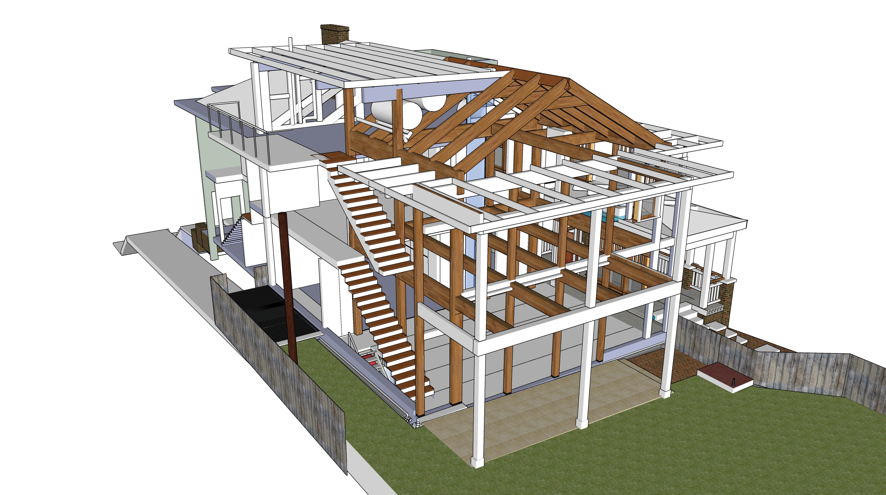
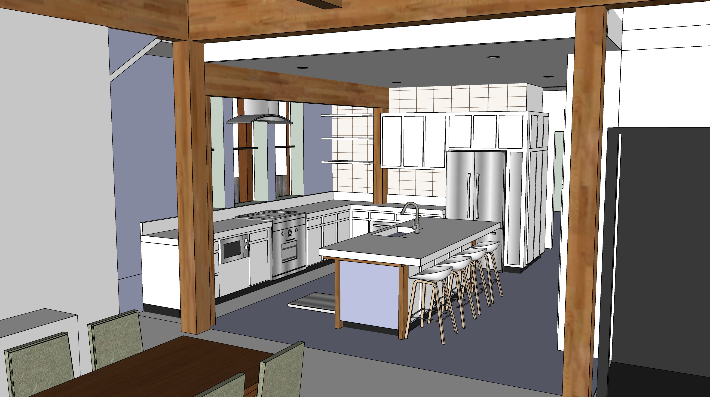
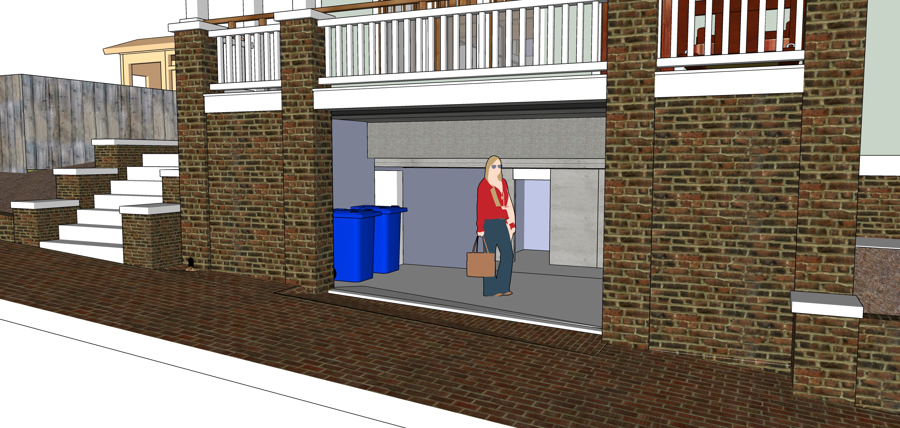

[721 Grant Street Addition](../)

<!--
Renovation Construction Loan
Based on value of home at time of project completion

Dan uses calendly.com

To do: 

Floor Area Ratio (FAR) - 55%

Zero lot line variance - Add photos of neighbors on Bass

-->
# Construction Phases

  

Rough estimates for construction phases.  <a href="sketchup/721-Grant-Street.skp">Download SketchUp Model</a> 

## Phase 1 - Pre-Construction Planning

| Spring and Summer 2021 | Min | Max |
|---|---|---|
| Advise on elevation documentation for city: Bass St entrance height, Basement 8' 3", Unfinished attic | $120 | $480 |
| Basement plan finalized, submitted for estimates, subcontrator secured | $480 | $2,500 |
| Ongoing Pre-Construction Planning, work with engineers to finalize material orders | $2,500 | $12,500 |

## Phase 2 - Move shed with crane. Interior Plaster Removal.

| Footings for Shed. Prepare to move lower laundry area. Weatherize roof exposed by removal. | Min | Max |
|---|---|---|
| Six stone bases for art shed using existing stone | $200 | $550 |
| Six brick columns for shed using bricks from west side of trash storage area | $300 | $600 |
| Shift enough dirt for tree-removal crane to enter backyard. Use railroad ties to mitgate errosion. Might take dirt to school or park. | $600 | $1,000 |
| Remove top roof. Remove second floor windows and lower door. Separate rear structure from building. | $400 | $500 |
| Weather-seal upper edge of house during removal. Reattach gutter. Cleanup. (Old siding will remain) | $200 | $800 |
| Remove deck at top of exterior stairway to clear path for movement of shed and tree.  | $100 | $200 |
| Add two 4x4s to reinforce open side of shed facing house. | $100 | $200 |
| Fridge will be moved into small room downstairs, then moved upstairs after craftroom counter is added (phase 13) |||
| &nbsp; | | |
| **Small Crane and Truck** | | |
| Move lower section of back laundry area as one unit using crane and truck bed. Cut large branches and cut down tree too close to other tree. | $2,000 | $4,000 |
| Cut up remaining branches of downed tree (small) | $200 | $300 |
| &nbsp; | | |
| **General Carpentry - Assemble shed, add reclaimed windows** | | |
| Assemble shed reusing windows and roof from upstairs laundry area. | $1,000 | $1,500 |
| &nbsp; | | |
| **On both levels, remove kitchen ceiling plaster and one side of south wall. Remove wall above stairway** | | |
| Park disposal truck at rear kitchen door for debris (plaster and wood slats). | $400 | $600 |
| Remove ceiling plaster and south interior wall plaster in both kitchens.  | $600 | $800 |
| Remove wall at back of closet above stairway. | $400 | $800 |
| &nbsp; | | |
| **Add more supports in basement, repoint bricks** | | |
| Add cement bases and 3 to 5 metal poles in crawlspace to reinforce west side of house. | $600 | $800 |
| Seal existing hole into crawl space after removing laundry area. Hole is about 2' tall by 3.5' wide. | $400 | $500 |
| Repoint existing bricks to add stability prior to basement dig. Repair crawlspace vent openings, patch wood holes. | $1,400 | $2,000 |

  

Rear laundry areas to be removed and converted into art shed: 
  
 
 
Protecting large trees.  Tree to be removed is smaller - between these two at northwest corner of house.
 

## Phase 3 - Basement, Drainage and Brickwork

<!--
Basement Framing and Pour
Possible resource: Fernando Garcia 404-538-2458 - Basement on Georgia Ave (July 2014) - Don't remember which house.
-->

| Prep for cement work |||
|---|---|---|
| Shift HVAC Units closer to house | $10 | $200 |
| Jackhammer existing north cement for AC pad. Removed concrete will be used to fill void under kitchen bumpout. Store concrete on northeast side of house.  | $400 | $800 |
| Remove remaining brick wall where trash resides. Retain bricks for reuse | $400 | $600 |
| Remove existing slate patio stones and concrete. Retain state for reuse as back porch. Store under exterior stairway. Store concrete on northeast side of house. | $200 | $400 |
| &nbsp; | | |
| **Basement/Cement Work** | | |
| Pour cement pad for AC Units (small) | $600 | $800 |
| Rear porch 3 cement pedestal bases (small) | $200 | $400 |
| Basement Dig, Frame and Pour - includes sump pump and a few feet of drain pipe  | $10,000 | $30,000 |
| North bump-out foundation cement pour at same time | $2,000 | $4,000 |
| Cemeent drain by porch with grate to catch leaves | $400 | $500 |
| Drains from brick porch area down to street below entrance, drain going east next to short brick wall | $800 | $1,500
| Pour higher basement level, 2 sets of cement steps and backing for brick walls on Bass Street | $1,000 | $2,500 |
| &nbsp; | | |
| **Brickwork** | | |
| Porch tiles laid out for rain absorption as back porch | $400 | $800 |
| Brick patio area above stairway, weed barrier fabric, sand under bricks| $300 | $500 |
| Reset sidewalk (center third of Bass frontage, create side slope away from basement, weed barrier. (Other areas of Bass Street have vulnerable trees, so avoid resetting bricks by 2 oak trees and at front of property by Grant Street) | $800 | $1000 |
| Brick walls of porch | $1000 | $3000 |
| &nbsp; | | |
| **Hollow core install** | | |
| Hollow core slabs, lifted into place by crane on truck | $15,000 | $25,000 |
| Weatherproof plywood cover over basement stair opening, secure from below. Hinges on east side for access to basement stairway. | $100 | $400 |

  
 
  
<!--
 
  
-->
 
  

## Phase 4 - Move Interior Stairway

May occur before phase 3 (basement) or before phase 7 (plumbing). [Project Details](initial)

|  |||
|---|---|---|
| **Prep/Reinforce** | | |
| Carefully remove bottom 5 or 6 treads. Retain for reuse. (Area below stairs is currently accessible from bathroom.) | | |
| Place temporary half-tread stairs on side by rail. Start temporary treads near door and place elevated walkway 6'2" from ceiling.  | | |
| Open up small portions of wall to determine if reinforcing uprights will be added | | |
| Add reinforcement in walls. Might add additional cement footing under house | | |
| Replace upstairs closet floor with angled stairway ceiling | | |
| Open walls for access to pipes for upstairs tub drain | | |
| Prep/Reinforce | $1,500 | $4,000 |
| &nbsp; |||
| **Add shower framework, Move Stairs, Resurface Treads** | | |
| Add framework and basin for shower in closet under stairs. | $1,000 | $2,000 |
| For narrow ceiling above shower entrance, use metal plate(s) welded as box. Waterprrof barrier. Fan vent will go through box. | $500 | $1,000 |
| Move stairs. Resurface treads (Patch, sand, stain, seal). Might flip treads. | $1,000 | $2,000 |
| &nbsp; |||

## Phase 5 - Move exterior AC units, add grate. Add basement door and window.

Two exterior mini-split units could also be added during this phase.

||||
|---|---|---|
| **Reposition 2 AC Units into new enclosure** | | |
| Extend and insulate freon lines | $600 | $800 |
| Grate over AC units | $800 | $1,500 |
| &nbsp; | | |
| **Sliding door to basement. Basement stairway, Window within basement.** | | |
| Basement sliding doors adjacent to sidewalk | $2,000 | $5,000 |
| Metal stairway in basement | $1,000 | $4,000 |
| Basement window under porch. Black frame, an old factory look. Slides or swings open fully.  | $900 | $1,400 |
| &nbsp; | | |
| **Front Porch Steps** | | |
| Detachable wooden porch steps over rain barrel area | $500 | $800 |

  
  
 

  
  

**Basement Details**  
 
  

## Phase 6 - Framework, Roof, Insulation, Windows, Siding
||||
|---|---|---|
| **Framework** | | |
| Framework including mass timber columns and attic roof Reuse wood from west side of roof for northeast height increase | $20,000 | $50,000 |
| Remove pulldown attic stairway while adding or extending a couple joists. | $1,000 | $2,000 |
| Create balcony by attaching extensions to joists over new jut-out. | $3,000 | $4,500 |
| Porch railings for lower south porch | $2,000 | $3,000 |
| Porch railings for upstaris west porch | $2,000 | $3,000 |
| Porch railings for attic porch | $800 | $1,000 |
| "Base Isolated" House - pads under mass timber columns to dampen earthquake vibration | $500 | $1,000 |
| &nbsp; |||
| **Roofing and Siding** |||
| Roofing for entire house (white surface for solar, close existing attic vent) | $8,000 | $20,000 |
| Insulation on addition | $1,500 | $3,000 | 
| Siding on addition | $4,000 | $7,000 | 
| &nbsp; |||
| **Exterior Doors and Windows** |||
| 2 exterior doors | $2,000 | $3,000 |
| 30 windows, including window between attic and master bedroom. Consider triple pane windows with argon fill - maybe on north side.| $18,000 | $25,000 |
| &nbsp; |||
| **Convert window to temporary doorway** |||
| Cut doorway at top of stairs by water heater | $400 | $500 |
| &nbsp; |||
| **North Storage Doors** |||
| Strong metal door on north storage compartment | $400 | $1,000 |
| &nbsp; |||
|**Two Stairways (rough)**|||
| 2 wooden staircases (rough) | $1,000 | $2,000 |
| &nbsp; |||
|**Remove Old Roof**|||
| Remove old roof under newly added shed roof. | $1,000 | $2,000 |
| &nbsp; |||
| **Existing upstairs bathroom** | | |
| Craft room walls and ceiling, move door frame to create bathroom sink area. Reinforce. | $1,000 | $2,000 |
| And new waterproof window interior | $800 | $1,500 |

  
 

  
 

## Phase 7 - Exterior Painting, Gutters, Replace or Seal Existing Storm Windows, Remove Bars

<!--
To get quote from: 
[overeducatedpainters.com](http://overeducatedpainters.com/)  
-->

|  |||
|---|---|---|
| Remove old storm windows and security bars, patch and repair | $800 | $2,000 |
| Prep and paint entire exterior | $8,000 | $12,000 |
| Add white storm windows - include some that open automatically with Google Home. | $10,000 | $18,000 |
| Gutters with leaf guards on addition | $1,000 | $2,000 |
| Copper gutter with leaf guard on north side of upper roof to reduce bacteria in future greywater system  | $500 | $800 |

## Phase 8 - Electric
||||
|---|---|---|
| Electrical work and lighting | $8,000 | $15,000 |
| Separate fuse boxes for new electric work.  | $500 | $1,000 |
| “Whole-house protector” $178 on Amazon for 140,000 amp Siemens FS140 Whole House Surge Protector. | $300 | $500 |
| Add new lights in existing stairway, update existing switches to be two-way | $400 | $1,500 |
| Lights in new downstairs shower | $200 | $600 |
| Hookup for towel warming rack in downstairs bathroom | $200 | $300 |

## Phase 9 - Mini-splits, Plumbing
| [Mini-split locations](../livingroom/#minisplits) |||
|---|---|---|
| Two exterior mini-split units | $2,000 | $3,000 |
| Mini-split in Downstairs Kitchen | $1,800 | $2,500 | 
| Mini-split in south livingroom wall | $2,000 | $2,800 |
| Mini-split above upstairs bathroom | $2,000 | $2,800 |
| &nbsp; |||
| <b>Downstairs Bathroom</b> | | |
| Add downstairs shower under stairway. Install pivoting towel shelf and vent. | $3,000 | $4,000 |
| &nbsp; |||
| **Upstairs Bathroom** | | |
| Move sink and toilet mount, new wall mounted toilet, add tub - [Wall photos](https://docs.google.com/document/d/1J0A26a7-Dvm3mscBRTSgxIeMxft11VZoRADT_unegkE/edit?usp=sharing) | $3,000 | $6,000 |
| Upstairs bathroom recessed lights and vanity light in  | $400 | $700 |
| &nbsp; |||
| **Plumbing** | | |
| Move gas line in attic under plywood. | $400 | $800 |
| Move water heater to attic. Hook up water and gas lines | $700 | $900 |
| Plumbing for sink in kitchen island. 4" Drain pipes already run to area. | $500 | $800 |
| Plumbing for sink in craft room | $100 | $200 |
| Plumbing for new upstairs bathrooms | $1,200 | $3,000 |  
| Existing bathrooms - Portion of pipes for bathroom modifications, including pipe to attic. (We may wait to add hole in roof.) | $400 | $700 |
| Install new incoming valve under house to increase pressure. | $300 | $600 |

## Phase 10 - Drywall, Interior Trim, Interior Painting, Stairway Completion, Interior Doors
||||
|---|---|---|
| **Existing front stairway** | | |
| Open cracks in existing front stairway, patch | $500 | $800 |
| Drywall in exisitng bathrooms. | $500| $800 |  
| Paint/stain existing front stairway | $200 | $700 |
| Paint existing bathrooms | $200 | $500 |
| &nbsp; |||
| **Drywall and Painting** | | |
| Expand window opening into doorway to upstairs laundry area | $200 | $800 |
| Drywall new addition, kitchen and craft room | $3,000 | $5,000 |
| Interior painting | $2,000 | $5,500 |
| Switch and plug covers | $400 | $800 |
| &nbsp; |||
| **New Stairways** | | |
| Complete 2 stairways with treads and banisters | $2,000 | $3,500 |
| Build 3 step wood stairway and landing on south side of living room | $900 | $1,200 |
| Build 3 step wood stairway to master bedroom | $500 | $800 |
| Build 3 step wood stairway to new bathrooms | $400 | $600 |
| &nbsp; |||
| **Interior Trim and Door Carpentry** | | |
| Build bathroom door frame from our wood trim collection. Hang door. Use 1 of 5 in attic | $500 | $800 |
| Hang additional doors currently in attic | $800 | $1,200 |
| Large sliding bathroom door | $800 | $1,200 |
| Door Hardware - Repair/upgrade doorknobs - Front door, bedroom, upstairs bathroom | $400 | $800 |

## Phase 11 - Tile and counter projects
||||
|---|---|---|
| Disconnect old sink in craftroom. Retain garbage disposal. | $50 | $100 |
| &nbsp; |||
| **New bathroom and laundry area** | | |
| South upstairs bathroom fixtures, shelf-cabinets and laundry area | $10,000 | $15,000 |
| [Mirror in front of window](https://www.houzz.com/photos/mirror-in-front-of-window-phbr0lbl-bl~l_51234) | $400 | $800 |
| Cabinet-closet in master bedroom - north wall | $500 | $800 |
| &nbsp; |||
| **Tile projects** | | |
| Tile in downstairs shower | $800 | $1,200 |
| Tile in upstairs shower existing bathroom | $800 | $1,200 |
| Tile in upstairs shower new bathroom | $800 | $1,200 |
| Tile in downstairs kitchen | $800 | $1,200 |
| Tile in craftroom | $800 | $1,200 |

  
<a href="../kitchen/#craftroom">Craftroom Images</a> 
  
 

  
 

## Phase 12 - Craftroom and Kitchen - Counters and Cabinets
||||
|---|---|---|
| **Craftroom counter and sink** | | |
| Add new counter with sink in craftroom (At this point, family will shift to using craftroom while downstairs kitchen is remodeled.) | $1,000 | $1,500 |
| &nbsp; |||
| **Downstairs Kitchen -  Remove hallway walls, Ceiling, Extend floor 3'** | | |
| Deactivate existing downstairs kitchen plumbing, electricity, remove counters and remove wall behind sink (reuse windows) | $400 | $500 |
| Remove wall above doorway, remove south side of hall closet, add framework | $400 | $800 |
| Drywall kitchen ceiling | $400 | $800 |
| Extend downstairs kitchen floor surface 3' into bumpout and resurface floor | $2,000 | $4,000 |
| &nbsp; |||
| **Downstairs Cabinetry** | | |
| Downstairs kitchen - counter. cabinets including south wall, sink, hookup dishwasher | $7,000 | $15,000 |
| Downstairs kitchen oven, either a hood or vent | $1,200 | $4,000 |
| Cabinet-size freezer for new kitchen - Might place upstairs as island initially | $1,400 | $1,800 |
| &nbsp; |||
| **Upstairs Cabinetry** | | |
| Upstairs craft room - cabinet on south wall | $1,500 | $1,800 |
| Craft room wood shelf | $400 | $600 |

  
 
<a href="../kitchen/">More Kitchen Images</a> 

 

 
---

# Basement Details

## Low Carbon Emission Concrete

Atlanta-based Thomas Concrete has been using the Canadian CarbonCure system since 2016.
[CNN Article](https://money.cnn.com/2018/06/12/technology/concrete-carboncure/index.html)  

"CarbonCure involves injecting carbon dioxide captured from various other industrial processes into concrete during the mixing process. A chemical reaction would “mineralize” that carbon dioxide, which would have the added benefit of making the concrete compressively stronger." “We have seen no downsides to using CarbonCure,”  Drew Millwood, the Thomas Concrete technician who oversaw the Kendeda job, writes: “It allows for cement reduction in any mix it is used in and provides strength at or above design. No cost increase is involved in a mix containing CO2 as the savings from cement reduction offset the cost of CO2 delivery. Equipment costs are easily recouped due to the savings.” - [source](https://livingbuilding.kendedafund.org/2019/07/16/carboncure/)  

## Hollow Core Concrete Slabs

<!--
  
 
-->
8” slab + 2” concrete topping. 10” total.  

Hollow Core slabs could provide a heat-sink in the main floor, storing heat generated from solar energy to radiate out at night.  Likely to use electric on basement floor to heat basement ceiling slab from below.

  

  

[Concrete Industries - Indiana](https://concreteindustries.com/hollowcore/)
**Specs**  
[8" Hollowcore with 2" composite topping](https://concreteindustries.com/wp-content/uploads/2017/07/Hollowcore-Load-Table-2in-Composite.pdf)  
[8" Hollowcore with no composite topping](https://concreteindustries.com/wp-content/uploads/2017/07/Hollowcore-Load-Table-No-Composite.pdf)
  

<!--
 
-->

### Sources of Precast Concrete for Hollow Core

[Precast Concrete Suppliers serving Georgia](https://www.thomasnet.com/georgia/precast-concrete-17311002-1.html)  

[Precast Concrete Directory](https://www.pci.org/PCI/Directories/PCICertifiedPlants.aspx)  

### Concrete with Cellulose Nanocrystals

Cellulose nanocrystals provide an avenue for water to hydrate cement particles when mixing.  

Cellulose-infused concrete is stronger and sets faster  

[Purdue Researchers](https://www.purdue.edu/newsroom/releases/2018/Q1/purdue-researchers-show-concrete-infused-with-wood-nanocrystals-is-stronger,-plan-to-use-it-in-california-bridge.html)  
[Thomas parking lot in Greenville](http://www.thomasconcrete.com/latest-news/thomas-concrete-partners-in-the-debut-of-a-concrete-mix-infused-with-cellulosic-nanomaterial)  

## Repointing Bricks

Sandstone mortar color, similar to left below. [Mortar Mix for Historic Homes](https://gpna.org/historic-home-care)  

 
  

A color more like our existing wall below than the red existing mortar...  

  
  

## Porch Railing Style

Not our house. For reference only...  

 

Waterflow at porch - Six levels of drain protection:

1. Area above stairs drains into pipe that outputs below porch.  
2. Downspout drains into three rain barrels within west side of porch, then outputs below porch.  
3. Sidewalk higher than stairs drains to outflow below porch below.  
4. Sidewalk lower than stairs has a drain before doorway.  Addition to sidewalk angles away from door.  
5. Goove below doors drains below porch.  
6. Interior floor angles away from deeper basement, which has a sump pump.  

 

---

