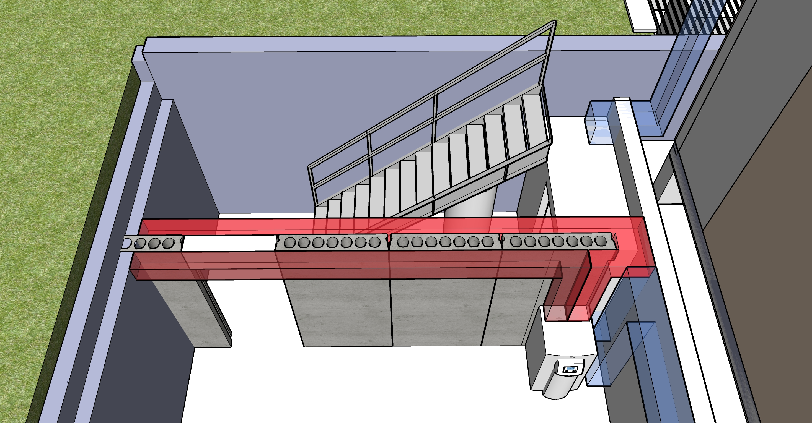

[721 Grant Street Addition](../)

# Construction Phases

<a href="sketchup/721-Grant-Street.skp">Download SketchUp Model</a>

Rough estimate of cost range for 10 construction phases, plus 1 optional phase.  
Projects indicated as "(small)" may be done independently by home owner.

## Phase 1 - Remove Rear. Assemble Art Shed. Reposition AC Units.

| Art Shed. Remove Kichen Ceilings. Cement AC Pad. Move AC Units | Min | Max |
|---|---|---|
| Art shed and AC grate planning | $500 | $800 |
| Jackhammer and remove cement for AC pad (small)  | $400 | $800 |
| Pour cement pad for AC Units (small) | $600 | $800 |
| Cement bases for for art shed footers (small) | $200 | $550 |
| Remove west brick wall where trash resides. Bricks will be used for shed footers (small) | $400 | $600 |
| 6 brick columns for shed. If short on bricks, some under portion being removed can be used (small) | $300 | $600 |
| Remove enough dirt for crane to enter backyard to avoid cutting trim limb | $600 | $1,000 |
| Cut and uses wedges below rear laundry room ceiling. Separate rear structure from building | $200 | $800 |
| <a href="shed">Flip shed</a> or use crane. Rove top roof. Move lower section. Guide down tree. | $2,000 | $4,000 |
| Weather-seal upper edge of house after removal. Attach gutter. Cleanup. (Old siding remains) | $200 | $800 |
| Assemble art shed. Cover half of roof with plywood and tarp. Rear wall of kitchens used later (small) | $1,000 | $2,000 |
| Cut up downed tree (small) | $200 | $300 |
| Remove ceiling and south wall in both kitchens. Truck to cart off mortal and backing wood. (small) | $800 | $1,500 |
| Move AC Units, extend freon lines | $600 | $800 |
| Purchase and install weatherproof west door to crawl space at existing hole under removed rear | $400 | $800 |
| Repoint existing bricks (north side done), repair vent openings, close holes, new trim on front porch | $1,000 | $2,000 |

  

  
 

## Phase 2 - Basement

<!--
Basement Framing and Pour
Possible resource: Fernando Garcia 404-538-2458 - Basement on Georgia Ave (July 2014) - Don't remember which house.
-->

| Cement work, window within basement, sliding basement entrance |||
|---|---|---|
| Rear porch 3 cement pedistal bases (small) | $200 | $400 |
| Basement - Main, includes digging, sump pump and start of drain pipe | $10,000 | $30,000 |
| North bumpout foundation | $2,000 | $4,000 |
| Cement steps on Bass Street | $1,000 | $2,500 |
| French drain pipe by porch - perforated, wrapped in screen in a bed of gravel inches from addition | $400 | $500 |
| Grate over HVAC units | $800 | $1,500 |
| Hollow core slabs, probably use crane | $15,000 | $25,000 |
| Metal stairway in basement | $1,000 | $4,000 |
| Weatherproof plywood cover over stair opening, secured from below (small) | $100 | $200 |
| Basement window under porch | $500 | $800 |
| Drains from brick porch area down to street | $100 | $150
| Brick by back porch area, sand with weed barrier | $300 | $500 |
| Reset sidewalk, create side slope weed barrier, sand to absorb water, careful with roots | $800 | $1000 |
| Basement sliding doors adjacent to sidewalk | $2,000 | $5,000 |
| Wooden porch steps - detachable, over rain barrels | $500 | $700 |
| Install tiny door, tiny sunburst (Abbey) | $0 | $0 |

  

  
 

## Phase 3 - Framework

| Mass Timber, Roofing, Windows, Siding |||
|---|---|---|
| "Base Isolated" House - pads to dampen earthquake vibration | $200 | $1,000 |
| Framework including porches | $20,000 | $50,000 |
| Roofing for entire house (prep for solar) | $7,000 | $10,000 |
| 31 windows, including attic-to-house. 2 exterior doors and siding on addition | $10,000 | $25,000 |
| Separate fuse box for new electric work. “Whole-house protector” in basement | $400 | $800 |
| Electrical work and Lighting | $5,000 | $12,000 |
| Doors on north storage compartments | $400 | $800 |
| New upstairs fuse box. Move all existing to new fuse boxes (upstairs and down) | $1,000 | $2,000 |

## Phase 4 - Drywall, Interior Trim, Stairways

| Interior Trim and Door Carpentry |||
|---|---|---|
| Expand window opening for doorway to new bathrooms (small) | $200 | $300 |
| Drywall | $3,000 | $5,000 |
| Vent covers and switch covers | $500 | $1,000 |
| 2 new wooden stairways - main floor and to attic | $3,800 | $6,000 |
| Build 4 step wood stairway at south entrance interior | $600 | $900 |
| Build 3 step wood stairway up to master bedroom | $500 | $800 |
| Build 3 step wood stairway up to new bathrooms | $400 | $600 |
| Build bathroom door frame from our wood collection. Hang door from 5 in attic | $500 | $800 |
| Large sliding bathroom door | $800 | $1,200 |
| Sliding screens (shoji) | $1,200 | $3,000 |
| Upstairs center bedroom closet and bathroom door  | $500 | $800 |
| Updates to southeast crawlspace door | $200 | $300 |
| Move water heater to attic. Hook up water and gas lines (small) | $700 | $900 |

| Phase 5 - Small freezer for new kitchen |||
|---|---|---|
| Place new freezer unit upstairs (will move downstairs later) | $ | $ |

| Phase 6 - Exterior painting and storm windows |||
|---|---|---|
| Remove old black storm windows and security bars | $ | $ |
| Minor repairs, paint prep, filling holes | $ | $ |
| Paint entire exterior | $ | $ |
| Add white storm windows (Window World used across the street) | $ | $ |

| Phase 7 - Grey water, Solar, AC Units, Heating unit in basement, New Bathrooms |||
|---|---|---|
| Grey water system | $ | $ |
| Solar panels | $ | $ |
| Storage battery and metered street units | $ | $ |
| North attic call AC units and ducts to kitchens and bathrooms | $ | $ |
| Kitchen and craft room vents, bathroom vents | $ | $ |
| South upstairs bathrooms, shelf-cabinets and laundry area | $10,000 | $15,000 |
| Cabinet-closet in master bedroom | $ | $ |
| Shelves for shoes along stairway to attic  | $ | $ |
| AC Unit in south porch roof | $ | $ |
| Heating unit in basement integrated with Hollow Core loops | $ | $ |

| Phase 8 - Craft room counter (small) |||
|---|---|---|
| Craft room shelf | $400 | $600 |
| Disconnect upstairs kitchen sink | $50 | $100 |
| New upstairs counter in craft room (temporary kitchen area) | $1,000 | $1,500 |
| Add new sink in craft room | $100 | $200 |

| New Kitchen, Cabinetry |||
|---|---|---|
| Remove downstairs kitchen counters and sink | $ | $ |
| Downstairs Kichen - cabinets, sink, oven, freezer unit | $ | $ |

| Porch fireplace, Porch Stonework, Rain Barrels |||
|---|---|---|
| Porch fireplace with ducts connecect to hollow core loop, barbecue grill with stone enclosure | $3,000 | $8,000 |
| Tiles laid out for rain absorption as back porch (small) | $ | $ |
| Rain barrels and pipe hookup under south steps | $ | $ |

| Existing Stairway, Existing Bathrooms |||
|---|---|---|
| Move existing front stairway (small) | $1,000 | $2,000 |
| New light(s) in existing stairway, update existing switches to be two-way | $400 | $800 |
| Existing upstairs bathroom - new waterproof window, move sink, new toilet, add tub (small) | $3,000 | $8,000 |
| Add downstairs shower under stairway | $1,500 | $3,500 |

| Phase 11 (optional, not in current financing) |||
|---|---|---|
| Existing porches - New ceilings with recessed lighting, dimmer, remove extra columns, surrounding molding  | $800 | $1,500 |
| Upstairs center bedroom - 6 lights with one dimmer switch (probably 3’ from corners) | $500 | $800 |
| Light-well material using elevator shaft | $2,000 | $6.000 |
| Basement chiller, fan and duct in elevator shaft | $4,000 | $8,000 |
| <a href="https://docs.google.com/document/d/12DIpuRJvCAZmODl7M-jmEJEsM0hCdxiBljkXsaRpKSs/edit?usp=sharing">Crawl Space Encapsulation</a> | $2,000 | $5,000 |
| Elevator | $7,000 | $12,000 |

 

 
---

### Low Carbon Emission Concrete

Atlanta-based Thomas Concrete has been using the Canadian CarbonCure system since 2016.
[CNN Article](https://money.cnn.com/2018/06/12/technology/concrete-carboncure/index.html)  

"CarbonCure involves injecting carbon dioxide captured from various other industrial processes into concrete during the mixing process. A chemical reaction would “mineralize” that carbon dioxide, which would have the added benefit of making the concrete compressively stronger." “We have seen no downsides to using CarbonCure,”  Drew Millwood, the Thomas Concrete technician who oversaw the Kendeda job, writes: “It allows for cement reduction in any mix it is used in and provides strength at or above design. No cost increase is involved in a mix containing CO2 as the savings from cement reduction offset the cost of CO2 delivery. Equipment costs are easily recouped due to the savings.” - [source](https://livingbuilding.kendedafund.org/2019/07/16/carboncure/)  

## Hollow Core concrete slabs

  
 

Hollow Ccre slabs will provide a heat-sink in the main floor, storing heat generated from solar energy to radiate out at night.  

8” slab + 2” concrete topping. 10” total.  

 2” Acid Wash Cement cover (Structural, composite concrete topping)

 <!--
 	Coreslab Structure (Atlanta) - Met Sales Rep Jay Rubinson jrubinson@coreslab.com 770-471-1150

 	Metal stairway version in SketchUp (nned to update height): 
	Industrial Stairway with 105" landing height and 36" width. 
	Factory Supply part number ISO105-36.

 -->
  

  

[Concrete Industries - Indiana](https://concreteindustries.com/hollowcore/)
**Specs**  
[8" Hollowcore with 2" composite topping](https://concreteindustries.com/wp-content/uploads/2017/07/Hollowcore-Load-Table-2in-Composite.pdf)  
[8" Hollowcore with no composite topping](https://concreteindustries.com/wp-content/uploads/2017/07/Hollowcore-Load-Table-No-Composite.pdf)
  

 

PCM placed in hollow core tubes as a thermal storage and supply system <a href="https://www.sciencedirect.com/science/article/abs/pii/S0378778815300591">PCM Research</a> 
Not that external air is NOT sent through the hollow core slab. Air would move in a loop.
  

  
Air would leave the electric heating unit on the right side, move though one of ten 50 foot loops in the hollow core basement ceiling, and return for reheating via the left duct.   

  
U-shaped pipes would connect sets of two pipes to create 10 loops.
  

<!--
Student researcher explaining an innovative [seismic retrofit](https://www.constructionspecifier.com/new-research-council-formed-for-concrete-industry/). 
Send suggestions to [ACI Foundation](https://www.acifoundation.org/research/suggestresearch.aspx)  

-->

### Sources of Precast Concrete for Hollow Core

[Precast Concrete Suppliers serving Georgia](https://www.thomasnet.com/georgia/precast-concrete-17311002-1.html)  

[Precast Concrete Directory](https://www.pci.org/PCI/Directories/PCICertifiedPlants.aspx)  

### Concrete with Cellulose Nanocrystals

Cellulose nanocrystals provide an avenue for water to hydrate cement particles when mixing.  

Cellulose-infused concrete is stronger and sets faster  

[Purdue Researchers](https://www.purdue.edu/newsroom/releases/2018/Q1/purdue-researchers-show-concrete-infused-with-wood-nanocrystals-is-stronger,-plan-to-use-it-in-california-bridge.html)  
[Thomas parking lot in Greenville](http://www.thomasconcrete.com/latest-news/thomas-concrete-partners-in-the-debut-of-a-concrete-mix-infused-with-cellulosic-nanomaterial)  

<!--
ICF insulated concrete foundation
ICF Builder
triple pane windows with argon fill on the north side of the house
-->

## Repointing Bricks

Sandstone mortar color, similar to left below. [Mortar Mix for Historic Homes](https://gpna.org/historic-home-care)  

 
  

A color more like our existing wall below than the red existing mortar...  

  
  

## AC Units, Grey Water Storage

### 5 sources of cold air
<!--A means to avoid duct work applied at the Kendeda Living Building.  -->

The home's two existing HVAC units will reside under grate on north side of house. 

An attic AC unit will connect to ducts and central elevator shaft.

A small AC unit will also reside within south porch ceiling.  
 
Chiller in basement will pump cold air up a duct within elevator shaft.  
<!-- Radiant pumping, chiller and air-handling unit. -->

<!--
Not using - Water Furnace Specs
https://www.waterfurnace.com/literature/envision/im1008hn.pdf
-->

  
 

About <a href="https://www.hpacmag.com/features/radiant-cooling/">radiant-cooling</a>  

Plans do not yet include location for “influx of fresh air” to stimulate building temperatures. Probably need to run through dehumidifier.  

### HVAC Duct Fabricators
Atlanta Supply - Logan Circle (for Ducts, custom)  
Custom sheet metal (pricy) [B & S Sheet Metal Fabricators Inc.](https://bsmetalfabricators.com/)  

Current HVAC in crawl space: Ducane  
Sept 2014 - Circuit board replaced  
Motor did not need to be replaced (m#FPBB100A5 S#20251005A PRODUCT#1006559993) 

<h2>West Elevation</h2> 
Cold air enters at upper left AC.  
Hot air generated in basement, lower left - Loops through concrete slabs as heat-sink while solar operational.
  

 
## Tankless Water Heaters

2 Tankless - One by laundry machine, one in basement by kitchen  

<a href="https://www.facebook.com/watch/live/?v=10160036402400436&ref=watch_permalink">Amy</a> presenting Rinnai Sensei tankless water heater, newer than Navien.  

Tank in upstairs kitchen will be moved into attic above north bathrooms.
<!-- 
<a href="http://www.marathonheaters.com/cons_specs.html">Rheem's Marathon Water Heater</a> - "The most durable electric water heater" - Under stairs  
-->

## Electrical

Recessed can lights (pot lights) will be used in all rooms.

<b>Resources</b>  
<a href="https://www.edrawmax.com/article/electrical-plan.html">How to layout electrical plan</a>  
<a href="https://3dwarehouse.sketchup.com/model/18515e9750cb23076d022864d00430d0/Electrical-Components?redirect=1">SketchUp Electrical Components</a>  

## Framework

Close existing attic vent  
Remove pulldown attic stairway, reinforce and close opening  
Extend attic beams over new jut-out on north side  

## Porch Railing Style

Nor our house. For reference only...  

 

Waterflow at porch...  

 

---

[Home](../)

