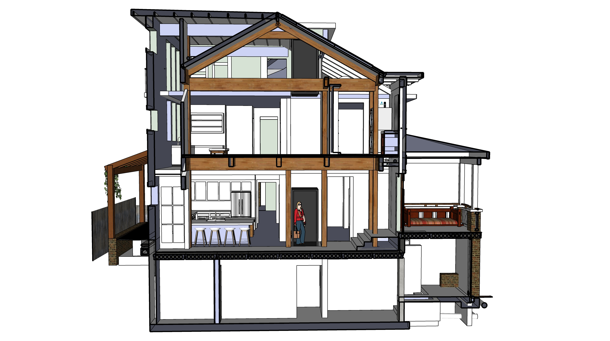

# Construction Phases

<a href="sketchup/721-Grant-Street.skp">Download SketchUp File (22 MB)</a>

Several projects indicated as small may be done independently by home owner.

Phase 1 - Shed, Demo, AC Pad, Move AC Units
1. Column bases for she-shed (small)
1. Remove rear and position as she-shed (Maybe use a crane)
1. Remove tree which is too close to other tree (small, or use crane)
1. Build she-shed. Use trunk of removed tree for 2 columns (small)
1. Remove ceiling and south wall in both kitchens (small)
1. Jackhammer and install cement pad for AC Units
1. Move AC Units, extend freon lines
1. Remove portion of brick wall, retain bricks

Phase 2 - Cement work, secure basement
1. Basement, north bumpout foundation
1. 3 rear porch pedistal bases (small)
1. Add weatherproof west door to connect basement to crawl space
1. Grate over HVAC units
1. Coreslab
1. Basement window under porch
1. Sump pump and drain pipes
1. Brick porch brickwork, reset sidewalk, cement steps
1. Basement sliding doors
1. Wooden porch steps - detachable, over rain barrels
1. Install tiny door, sunburst (Abbey)

Phase 3 - Framework, Roofing, Windows, Siding
1. Framework including porches
1. Roofing for entire house (prep for solar)
1. Windows and siding on addition
1. Doors on north storage compartments

Phase 4 - Drywall, Stairways
1. Drywall
2. Vent covers and switch covers
1. 3 stairways (maybe steel stairway in basement)
1. South entrance wood stairway (4 steps)
1. Steps up to master bedroom
1. Updates to door under house, east side

Phase 5 - Short freezer
1. Place new freezer unit upstairs (will move downstairs later)

Phase 6 - Exterior painting and storm windows
1. Remove old black storm windows and security bars
1. Minor repairs, paint prep, filling holes
1. Paint entire exterior
1. Add white storm windows (Window World used across the street)

Phase 7 - Grey water, Solar, AC Units, Heating unit in basement
1. Grey water system
1. Solar panels
1. Storage battery and metered street units
1. North attic call AC units and ducts to kitchens and bathrooms
1. Kitchen and craft room vents, bathroom vents
1. South upstairs bathrooms and laundry area
1. AC Unit in south porch roof
1. Heating unit in basement integrated with Coreslab

Phase 8 - Craft room counter (small)
1. Disconnect upstairs kitchen sink
1. New upstairs counter in craft room (temporary kitchen area)
1. Add new sink in craft room

Phase 9 - New Kitchen, Barbecue, Porch Stonework, Rain Barrels
1. Remove downstairs kitchen counters and sink
1. Downstairs Kichen - cabinets, sink, oven, freezer unit
1. Tiles laid out for rain absorption as back porch (small)
1. Rear barbecue grill with stone enclosure
1. Rain barrels and pipe hookup under south steps

Phase 10 - Existing Stairway, Existing Bathrooms
1. Move existing front stairway (small)
1. Existing upstairs bathroom - new waterproof window, move sink, new toilet, add tub
1. Add downstairs shower under stairway

Phase 11 (optional, not in current financing)
1. Light-well material using elevator shaft
1. Basement chiller and elevator shaft duct
1. Elevator

1. Repoint bricks, reduce vent openings, close holes, new trim on front porch
  

---

# Basement

  
 

### Zero Emission Concrete

Atlanta-based Thomas Concrete has been using the Canadian CarbonCure system since 2016.
[CNN Article](https://money.cnn.com/2018/06/12/technology/concrete-carboncure/index.html)  

"CarbonCure involves injecting carbon dioxide captured from various other industrial processes into concrete during the mixing process. A chemical reaction would “mineralize” that carbon dioxide, which would have the added benefit of making the concrete compressively stronger." “We have seen no downsides to using CarbonCure,”  Drew Millwood, the Thomas Concrete technician who oversaw the Kendeda job, writes: “It allows for cement reduction in any mix it is used in and provides strength at or above design. No cost increase is involved in a mix containing CO2 as the savings from cement reduction offset the cost of CO2 delivery. Equipment costs are easily recouped due to the savings.” - [source](https://livingbuilding.kendedafund.org/2019/07/16/carboncure/)  

## Coreslab

  
 

### Hollow Core

Heat-sink in the main floor coreslab stores solar energy, radiates out at night.  

8” slab + 2” concrete topping. 10” total.  

 2” Acid Wash Cement cover (Structural, composite concrete topping)

 <!--
 	Coreslab Structure (Atlanta) - Met Sales Rep Jay Rubinson jrubinson@coreslab.com 770-471-1150
 -->

  

[Concrete Industries - Indiana](https://concreteindustries.com/hollowcore/)
**Specs**  
[8" Hollowcore with 2" composite topping](https://concreteindustries.com/wp-content/uploads/2017/07/Hollowcore-Load-Table-2in-Composite.pdf)  
[8" Hollowcore with no composite topping](https://concreteindustries.com/wp-content/uploads/2017/07/Hollowcore-Load-Table-No-Composite.pdf)
  

 

PCM placed in concrete coreslab tubes as a thermal storage and supply system <a href="https://www.sciencedirect.com/science/article/abs/pii/S0378778815300591">PCM Research</a> 
Not that external air is NOT sent through the coreslab. Air would move in a loop.
  

  
Air would leave the electric heating unit on the right side, move though one of ten 50 foot loops in the coreslab basement ceiling, and return for reheating via the left duct.   

  
U-shaped pipes would connect sets of two pipes to create 10 loops.
  

<!--
Student researcher explaining an innovative [seismic retrofit](https://www.constructionspecifier.com/new-research-council-formed-for-concrete-industry/). 
Send suggestions to [ACI Foundation](https://www.acifoundation.org/research/suggestresearch.aspx)  

-->

### Precast Concrete

[Precast Concrete Suppliers serving Georgia](https://www.thomasnet.com/georgia/precast-concrete-17311002-1.html)  

[Precast Concrete Directory](https://www.pci.org/PCI/Directories/PCICertifiedPlants.aspx)  

### Concrete with Cellulose Nanocrystals

Cellulose nanocrystals provide an avenue for water to hydrate cement particles when mixing.  

Cellulose-infused concrete is stronger and sets faster  

[Purdue Researchers](https://www.purdue.edu/newsroom/releases/2018/Q1/purdue-researchers-show-concrete-infused-with-wood-nanocrystals-is-stronger,-plan-to-use-it-in-california-bridge.html)  
[Thomas parking lot in Greenville](http://www.thomasconcrete.com/latest-news/thomas-concrete-partners-in-the-debut-of-a-concrete-mix-infused-with-cellulosic-nanomaterial)  

<!--
ICF insulated concrete foundation
ICF Builder
triple pane windows with argon fill on the north side of the house
-->

## North AC Unit, Grey Water Storage and Grate over HVAC Units

### Radiant pumping, chiller and air-handling unit.
<!--A means to avoid duct work applied at the Kendeda Living Building.  -->

Our central elevator shaft will allow chilled air to fall from an attic AC unit.  
A small AC unit will also reside within south porch ceiling.  

<!--
Not using - Water Furnace Specs
https://www.waterfurnace.com/literature/envision/im1008hn.pdf
-->

  
 

Two existing HVAC units will reside under grate on north side of house.  
Chiller in basement will pump cold air up a duct within elevator shaft.  
About <a href="https://www.hpacmag.com/features/radiant-cooling/">radiant-cooling</a>  

<h2>West Elevation</h2> 

### HVAC Duct Fabricators
Atlanta Supply - Logan Circle (for Ducts, custom)  
Custom sheet metal (pricy) [B & S Sheet Metal Fabricators Inc.](https://bsmetalfabricators.com/)  

Current HVAC in crawl space: Ducane  
Sept 2014 - Circuit board replaced  
Motor did not need to be replaced (m#FPBB100A5 S#20251005A PRODUCT#1006559993)  

## Water Heaters

2 Tankless - One by laundry machine, one in basement by kithen  

<a href="https://www.facebook.com/watch/live/?v=10160036402400436&ref=watch_permalink">Amy</a> presenting Rinnai Sensei tankless water heater, newer than Navien.  

1 Tank understairs  
<a href="http://www.marathonheaters.com/cons_specs.html">Rheem's Marathon Water Heater</a> - "The most durable electric water heater" - Under stairs  

## Repointing Bricks

Sandstone mortar color, similar to left below. [Mortar Mix for Historic Homes](https://gpna.org/historic-home-care)  

 
  

More like the wall...  

 

---

[Home](../)

