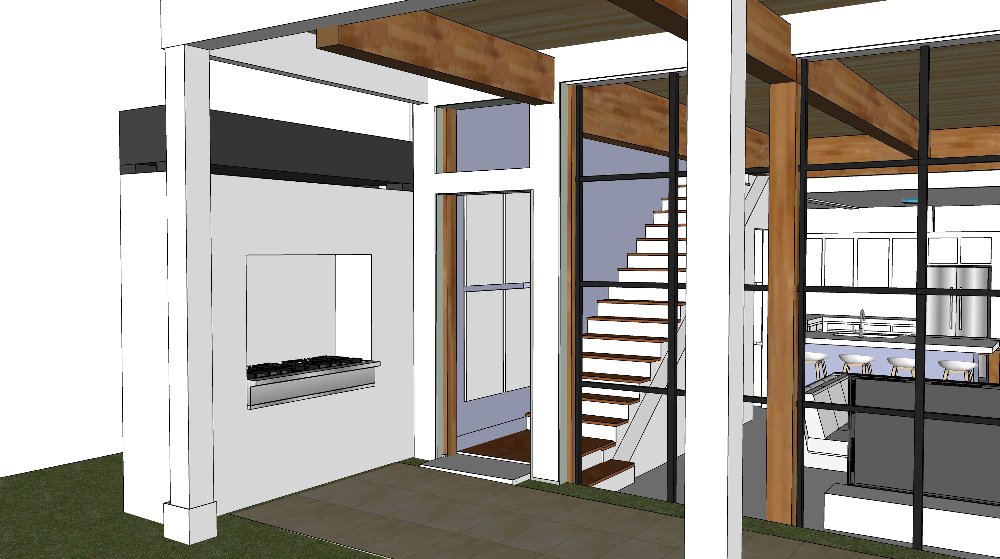
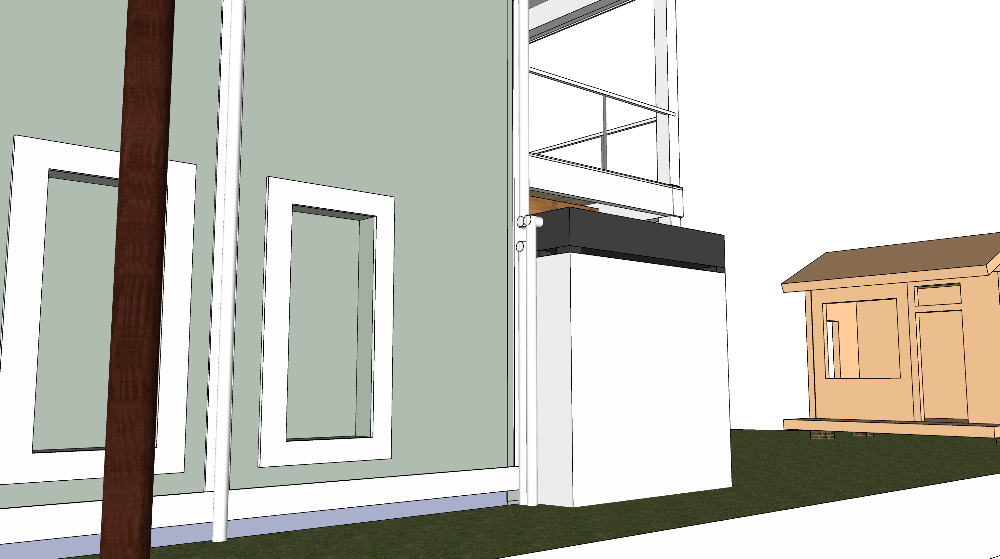

<!--
ICF insulated concrete foundation
ICF Builder
-->

## Exterior Fireplace
The fireplace will convert from a range to a pit for burning wood.
  
  

Enclosed air tubes in the top of fireplace will connect to the basement loop to circulate heat into floor slabs.  
The tube will snake through the top of the fireplace, so air with ashes is not mixing with the house loop.
  
  

