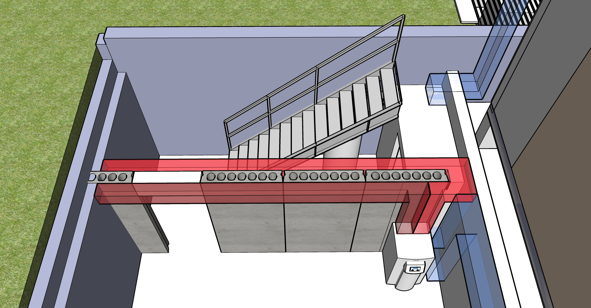
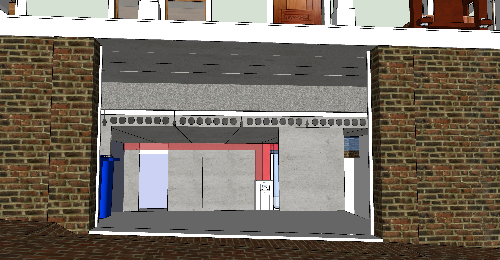

We are not planning to do this...  
PCM can be placed in hollow core tubes as a thermal storage and supply system <a href="https://www.sciencedirect.com/science/article/abs/pii/S0378778815300591">PCM Research</a> 
Note that external air is NOT sent through the hollow core slab. Air moves in a loop.
  

  
Air flow leaves the electric heating unit on the right side, move though hollow core basement ceiling, and return for reheating via the left duct.   

  
U-shaped pipes would connect sets of two pipes to create ten 50 foot loops. Air circulating through slabs would not be mixed with home air.
  

<!--
Student researcher explaining an innovative [seismic retrofit](https://www.constructionspecifier.com/new-research-council-formed-for-concrete-industry/). 
Send suggestions to [ACI Foundation](https://www.acifoundation.org/research/suggestresearch.aspx)  

-->

<b>Options to investigate</b>
1. Heating with ten 48' airflow loops within concrete. Thin top surface. Same heating unit would also heat home air for quick heating.  
2. Heating with water pipes within 2” Acid Wash Cement cover (Structural, composite concrete topping)

 <!--
 	Coreslab Structure (Atlanta) - Met Sales Rep Jay Rubinson jrubinson@coreslab.com 770-471-1150

 	Metal stairway version in SketchUp (nned to update height): 
	Industrial Stairway with 105" landing height and 36" width. 
	Factory Supply part number ISO105-36.

 -->
 