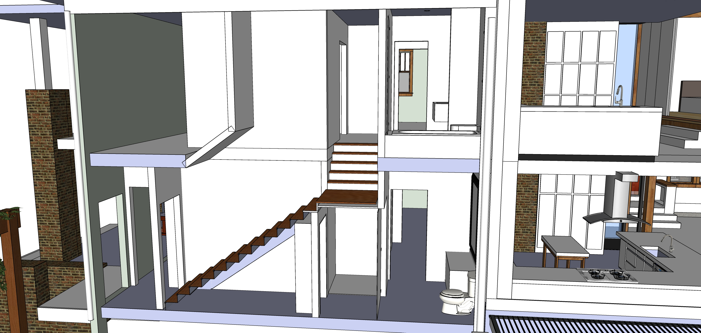
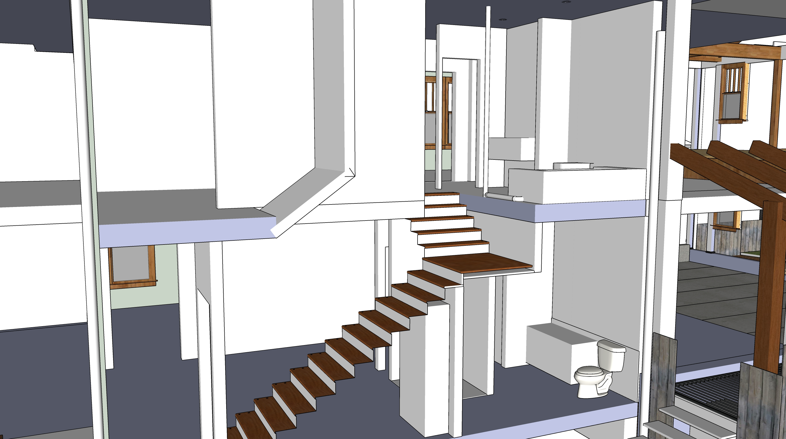
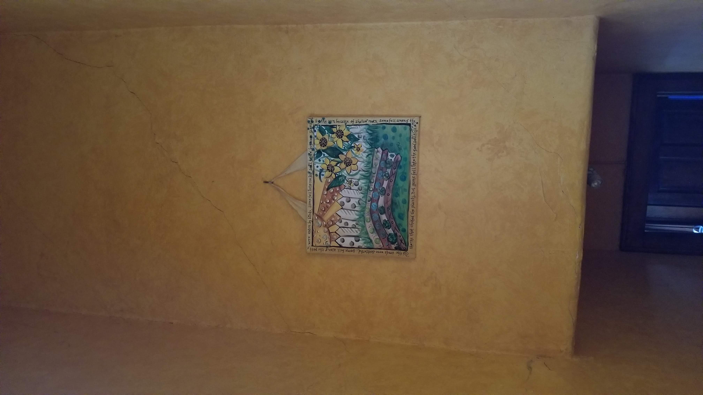
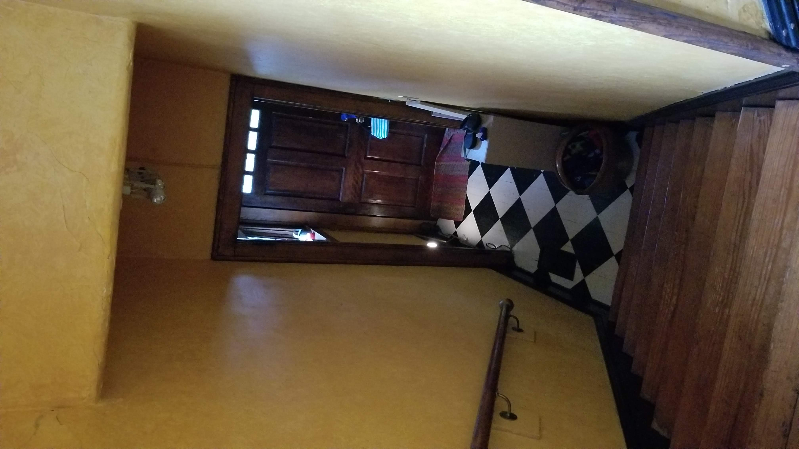
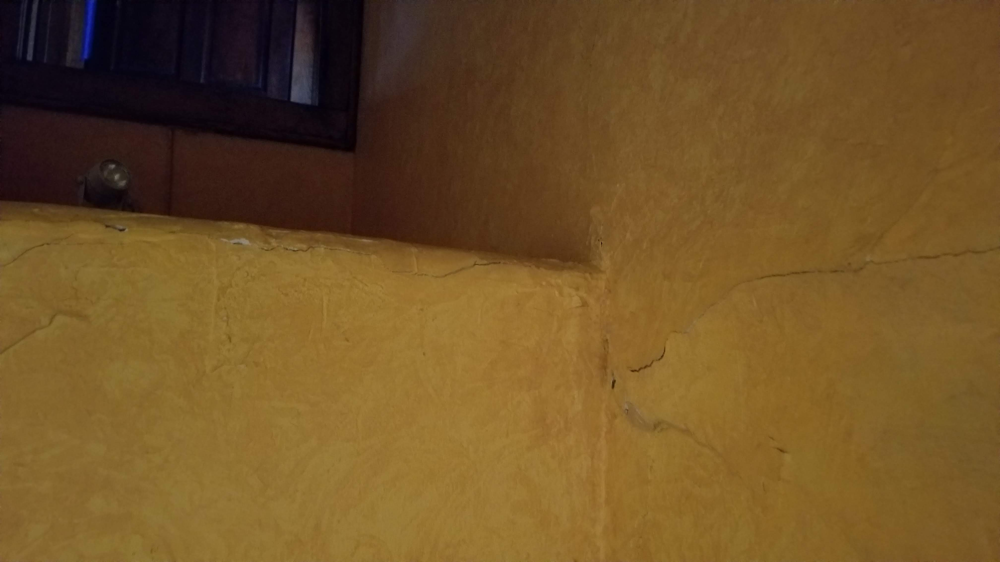
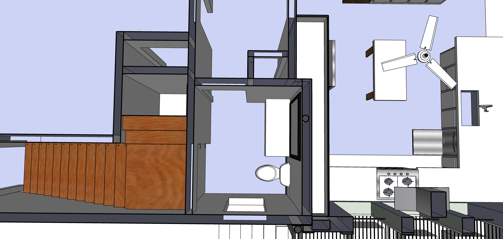
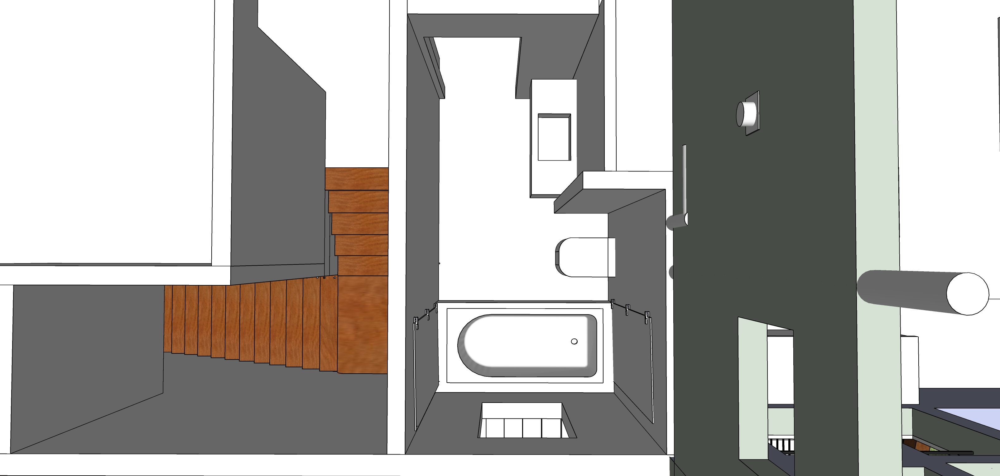

### [721 Grant Street](../../)

# Front Stairway Project

Occurs within the following [construction phases](../)

**Phase 2:** Demo wall above stairs. Open up wall and reinforce support column.  
**Phase 4:** Add framework for shower in closet under stairs. Move existing stairway 5 feet.  
**Phase 6:** Framework for existing upstairs bathroom - move wall for sink. Open wall from kitchen side for toilet move.  
**Phase 9:** Plumbing.  
**Phase 10** Drywall in exisitng bathrooms.  
**Phase 11:** Tile in downstairs shower. Tile in existing bathroom upstairs - shower around window.  

  

  

 

 
---

The wall above the stairway will be replaced with lighter drywall. A 45 degree angle will be added for head clearance.  

 

  

Compression of north wall causing plaster to bulge.  

## Downstairs Bathroom - Shower under stairway

 

## Upstairs Bathroom

 
Waterproof window. Two swinging shower doors. Entrance wall/door moved to add space for sink area.  

 
  