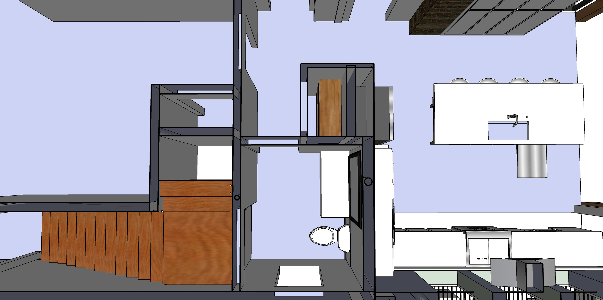
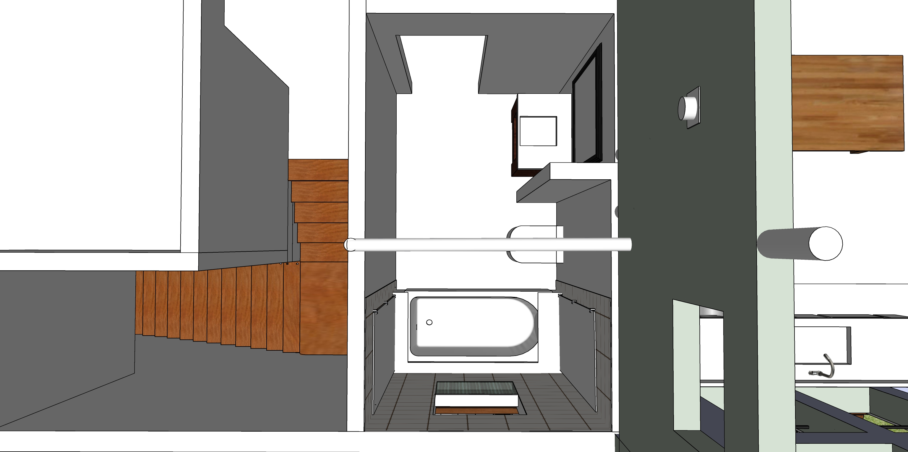

# 721 Grant Street

## Moving existing stairway 5 feet, Upgrades to two existing bathrooms

  

|  |||
|---|---|---|
| **Prep/Reinforce** | | |
| Carefully remove bottom 5 or 6 treads. Retain for reuse. Area below stairs is accessible from bathroom. | | |
| Place temporary half-tread stairs on side by rail. Start temporary treads near door and place elevated walkway 6'2" from ceiling.  | | |
| Open up small portions of wall to determine if reinforcing uprights will be added | | |
| Add reinforcement in walls. Might add additional cement footing under house | | |
| Replace upstairs closet floor with angled stairway ceiling | | |
| Open walls for access to pipes for upstairs tub drain | | |
| Prep/Reinforce | $1,200 | $3,000 |
| &nbsp; |||
| **Move Stairs, Resurface Treads** | | |
| Move stairs. Resurface treads (Patch, sand, stain, seal). Might flip treads. | $1,000 | $2,000 |
| For narrow ceiling above shower entrance, use metal plate with right angle edge. Waterprrof barrier. | $500 | $1,000 |
| &nbsp; |||
| **Plumbing** | | |
| Portion of pipes for bathroom modifications, including pipe to attic. (We may wait to add hole in roof.) | $400 | $700 |
| Install new incoming valve under house to increase pressure. | $300 | $600 |
| &nbsp; |||
| <b>Downstairs Bathroom</b> | | |
| Add downstairs shower under stairway, including movable towel shelf. Tile. Vent. | $2,000 | $5,000 |
| &nbsp; |||
| &nbsp; |||
| **Electric** | | |
| Add new lights in stairway, update existing switches to be two-way | $400 | $1,500 |
| Lights in new downstairs shower, investigate flickering  | $200 | $600 |
| &nbsp; |||
| **Drywall and Painting** | | |
| Drywall/patch hallway, patch existing cracks | $200 | $500 |
| Paint/stain stairway | $200 | $700 |

Completion of upstairs bathroom is later in [phases 4 and 7](../)

 

 
---

The wall above the stairway will be replaced with lighter drywall. A 45 degree angle will be added for head clearance.  

 

  

Compression of north wall causing plaster to bulge.  

## Downstairs Bathroom - Shower under stairway

 

## Upstairs Bathroom

 
Waterproof window in tub shower. Two swinging shower doors. Entrance wall/door moved to add space for sink area.  

 
  