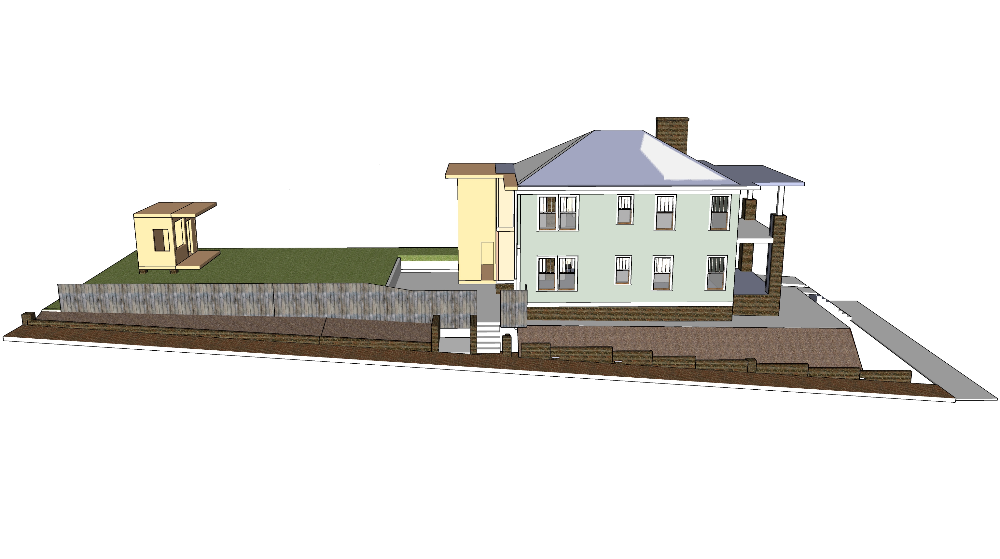
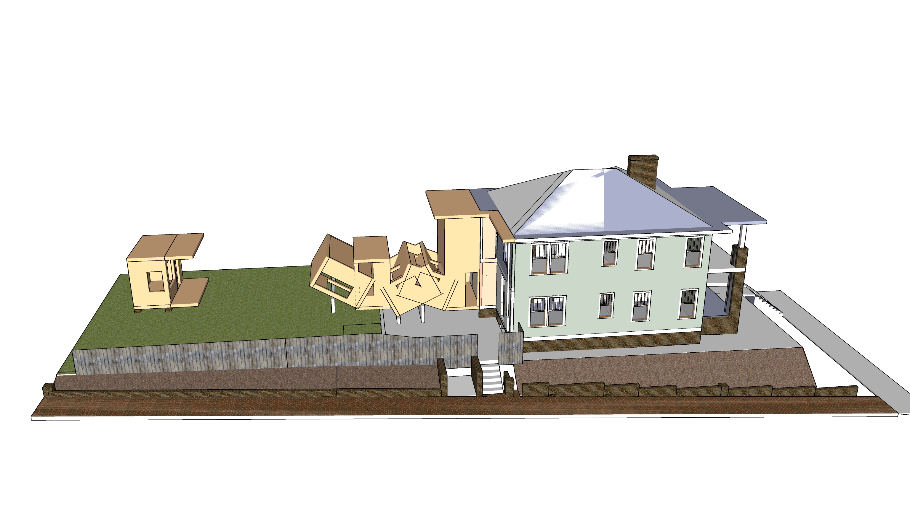

[Phases](../)

# Moving Art Shed

Option 1: Add support structure to side facing house using 4x4 from top section. Then flip shed up hill using a wood structure to pivot for easier lifting with long jacks.  

Option 2: Lift off the roof with crane. Lift lower floor with ceiling attached as one unit. Wall and dirt can be removed to allow crane to work on north side of tree branches.

  
 

  
 

[Home](../../)